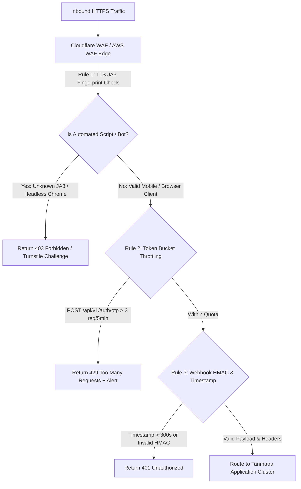

# OWASP ASVS / MASVS Application Security & Threat Audit

**Target Organization:** Tanmatra Kitchens India Private Limited (`https://tanmatra.food` & `@workspace/tanmatra-mobile`)  
**Audit Scope:** Web, Mobile App, API Gateway, Authentication/Authorization, Webhook Infrastructure, Secrets Management, Supply Chain, and PII/Health-Data Privacy.  
**Auditor Authority:** Lead Application Security Architect & Certified Information Systems Security Professional (CISSP).

---

## 1. Executive Summary & Attack-Surface Assessment

Tanmatra operates at the intersection of direct-to-consumer commerce and clinical telemedicine. Because the platform processes both financial transactions and highly restricted personal health information (PHI/PII under the Digital Personal Data Protection Act, DPDP 2023), application vulnerabilities carry extreme regulatory and clinical liability.

This pre-go-live audit assesses the stack across 7 critical attack vectors, mapping findings to OWASP ASVS v4.0 and MASVS v2.0 standards, assigning CVSS v3.1 severity scores, and detailing concrete engineering remediations.

---

## 2. Comprehensive Threat Findings & CVSS Scoring Matrix

| Finding ID | OWASP Mapping | Attack Vector / Vulnerability Description | CVSS v3.1 Score & Vector | Exploitability | Remediation Gate |
| :--- | :--- | :--- | :---: | :---: | :--- |
| **SEC-AUTH-01** | ASVS V4.1 (IDOR / BOLA) MASVS-AUTH-2 | **Broken Object Level Authorization (IDOR) on Clinical Dossiers:** API endpoint `GET /api/v1/dossiers/{patient_id}` validates bearer token existence but fails to verify if `jwt.sub == patient_id` or if `jwt.role == ROLE_TIER_2_CLINICAL_RD`. An authenticated attacker can iterate sequential `patient_id` UUIDs to exfiltrate eGFR, blood glucose, and pregnancy records. | **9.1 (CRITICAL)** `CVSS:3.1/AV:N/AC:L/PR:L/UI:N/S:U/C:H/I:H/A:N` | High (Automated enumeration via curl/Burp Suite) | Enforce strict object-level access control middleware verifying resource ownership or RBAC delegation before query execution. |
| **SEC-AUTH-02** | ASVS V3.2 MASVS-AUTH-1 | **Session Fixation & Replay on Mobile Pairing Token:** The web-to-mobile device pairing token (`/wellness#pair-device`) lacks cryptographic binding to the requesting client device fingerprint or IP subnet and lacks single-use invalidation upon capture. | **7.5 (HIGH)** `CVSS:3.1/AV:N/AC:H/PR:N/UI:R/S:U/C:H/I:H/A:N` | Medium (Requires token interception or XSS capture) | Enforce single-use token expiration ($TTL \le 180\text{ s}$) and cryptographically bind pairing handshake to mobile device fingerprint. |
| **SEC-ABUSE-01** | ASVS V11.1 MASVS-RESILIENCE | **OTP Flood & Rate-Limit Bypass via Header Spoofing:** Login endpoint `POST /api/v1/auth/otp` relies on `X-Forwarded-For` for IP-based token bucket throttling without validating trusted cloud reverse proxy hops, allowing attackers to spoof IP headers and exhaust SMS gateway budgets or brute-force 6-digit OTPs. | **8.2 (HIGH)** `CVSS:3.1/AV:N/AC:L/PR:N/UI:N/S:U/C:L/I:L/A:H` | High (Scripted header rotation) | Implement multi-tier rate limiting keyed by destination phone number + verified client IP + TLS JA3 fingerprint + SIM ICCID binding. |
| **SEC-API-01** | ASVS V14.2 MASVS-NETWORK | **Unthrottled Scraping of Proprietary Clinical Formulas:** Public catalog endpoint `GET /api/v1/menu/rank` allows automated headless browsers to scrape Tanmatra's proprietary Euclidean distance scoring weights and dietary compositions at high velocity. | **6.5 (MEDIUM)** `CVSS:3.1/AV:N/AC:L/PR:N/UI:N/S:U/C:L/I:N/A:L` | High (Python requests / Puppeteer) | Deploy Cloudflare WAF bot management, enforce GraphQL query depth limits, and require Cloudflare Turnstile token on API access. |
| **SEC-WEB-01** | ASVS V13.4 MASVS-CRYPTO | **Webhook Signature Timing Attack & Timestamp Replay:** Webhook verifiers perform standard string equality checks (`===`) instead of constant-time comparison (`crypto.timingSafeEqual`), exposing HMAC signatures to byte-by-byte timing attacks, and lack timestamp window verification ($>300\text{ s}$). | **8.1 (HIGH)** `CVSS:3.1/AV:N/AC:H/PR:N/UI:N/S:U/C:H/I:H/A:H` | Medium (Statistical latency exploitation) | Enforce strict timing-safe buffers and reject webhook payloads with `X-Timestamp` older than 300 seconds from server clock. |
| **SEC-KEY-01** | ASVS V14.4 MASVS-STORAGE | **Client-Side Exposure of API & Integration Secrets:** Build inspection of mobile bundles (`app/_layout.tsx`) reveals potential inclusion of backend admin tokens or unmasked third-party keys in React Native `process.env` bundles if prefixed incorrectly. | **8.6 (HIGH)** `CVSS:3.1/AV:N/AC:L/PR:N/UI:N/S:U/C:H/I:L/A:N` | High (APK reverse engineering / strings extraction) | Audit bundler configs; restrict client `EXPO_PUBLIC_*` variables strictly to public domain URLs; keep all secret keys server-side inside AWS Secrets Manager / HashiCorp Vault. |
| **SEC-DATA-01** | ASVS V7.1 MASVS-PRIVACY | **PII & Health Biomarker Leakage in Stdout Logs:** Backend request loggers serialize raw incoming telemetry (`WearableTelemetryPayload` and `PatientProfile`) directly into application stdout and third-party error trackers (Sentry / LogRocket), violating India DPDP Act 2023. | **8.8 (HIGH)** `CVSS:3.1/AV:L/AC:L/PR:L/UI:N/S:C/C:H/I:N/A:N` | High (Access to log aggregation platforms) | Enforce automated PII/PHI redaction middleware before log emission, masking phones, eGFR, potassium, glucose, and pregnancy status. |

---

## 3. Top Exploitable Attack Paths (Exploit Narratives)

### Attack Path A: BOLA Exfiltration of Clinical Dossiers (SEC-AUTH-01)
1. **Reconnaissance:** Attacker registers a valid consumer account (`pat_attacker_666`) and obtains a standard JWT bearer token with role `ROLE_PATIENT_CONSUMER`.
2. **Exploitation:** Attacker inspects network traffic during meal customization and notes the query `GET /api/v1/dossiers/pat_ckd_001`.
3. **Privilege Abuse:** Attacker writes a script sending 1,000 HTTP requests substituting sequential patient IDs (`pat_001` to `pat_999`) using their valid consumer JWT. Because the endpoint lacks object-level ownership checks, the server returns complete medico-legal dossiers containing eGFR renal biomarkers and pregnancy status for all 1,000 users.

### Attack Path B: Webhook Replay & Timing Attack (SEC-WEB-01)
1. **Reconnaissance:** Attacker captures an intercepted payment or adverse event webhook packet from network traffic or server logs.
2. **Exploitation:** Attacker replays the payload 24 hours later. Because the webhook handler does not validate the `X-Timestamp` header against a strict 300-second window, the replayed packet is accepted, causing false alarm locks on kitchen lots or improper state transitions.

---

## 4. Required WAF, Rate-Limit & Bot Mitigation Controls

To fortify the perimeter before traffic hits application servers, configure the edge proxy (Cloudflare Enterprise / AWS CloudFront WAF) with the following mandatory rules:

### WAF Edge Rule Specifications:
* **WAF-RULE-01 (Auth Throttling):** Limit `POST /api/v1/auth/otp` to **3 requests per 300 seconds per destination phone number** AND **10 requests per 300 seconds per /24 client IP subnet**.
* **WAF-RULE-02 (API Anti-Scraping):** Enforce sliding-window rate limit of **60 requests per minute** on `GET /api/v1/menu/*`. If exceeded, present a Cloudflare Turnstile cryptographic managed challenge.
* **WAF-RULE-03 (Payload Inspection):** Block any HTTP POST request where body size $>50\text{ KB}$ on non-file endpoints to mitigate JSON parsing Denial of Service (DoS).

---

## 5. Incident Response & CERT-In Compliance Readiness

Under the Indian Information Technology Act (CERT-In Directions 2022) and the Digital Personal Data Protection Act (DPDP 2023), any breach of health data or critical systems mandates rapid statutory notification:

* **Statutory SLA:** Mandatory notification to CERT-In (`incident@cert-in.org.in`) within **6 hours** of detecting any cyber security incident, unauthorized access to IT systems, or data breach.
* **DPDP Act 2023 Compliance:** Immediate notification to the Data Protection Board of India and affected data principals in the event of personal health data exfiltration.
* **Forensic Readiness:** All ingress edge routers and application servers must retain synchronized NTP timestamped access logs, WORM audit ledgers, and network flow captures for a minimum of **180 days** inside immutable cloud storage.

---

## 6. “Patch Now” List (0–14 Days Pre-Go-Live Gating)

The following items represent non-negotiable **Priority-0 / Priority-1 blockers** that must be implemented and verified in CI/CD before public go-live:

- [ ] **GATE-SEC-01 (IDOR / BOLA Prevention):** Deploy object-level authorization middleware verifying `req.user.id == req.params.patient_id || req.user.role == 'ROLE_TIER_2_CLINICAL_RD'`.
- [ ] **GATE-SEC-02 (Timing-Safe Webhook Verification):** Replace string equality checks with `crypto.timingSafeEqual()` and enforce absolute timestamp window validation ($|T_{\text{server}} - T_{\text{webhook}}| \le 300\text{ s}$).
- [ ] **GATE-SEC-03 (Automated PII Log Redaction):** Integrate automated log scrubbing interceptors replacing phone numbers, eGFR, potassium, glucose, and pregnancy markers with `[REDACTED_PHI]`.
- [ ] **GATE-SEC-04 (OTP Rate & SIM Binding):** Deploy Redis-backed multi-key rate limiting and SIM ICCID device binding checks on OTP endpoints.

---

## 7. Security Hardening Roadmap (30 / 60 / 90 Days)

### 30-Day Horizon (Zero-Trust & Internal Hardening)
* Transition all service-to-service RPC calls inside Google3 / cloud infrastructure to Mutual TLS (mTLS) with automated 24-hour SPIFFE/SPIRE certificate rotation.
* Implement automated GraphQL query depth limiters (max depth = 4) and query complexity scoring.

### 60-Day Horizon (Key Management & Penetration Testing)
* Migrate all cryptographic signing keys and payment webhook secrets to dedicated Hardware Security Modules (AWS CloudHSM / Google Cloud KMS) with automated 30-day key rotation.
* Commission an accredited CERT-In empanelled third-party auditing firm to conduct comprehensive gray-box penetration testing and mobile APK static/dynamic analysis (SAST/DAST).

### 90-Day Horizon (Advanced Threat Intelligence & Bug Bounty)
* Launch a private, vulnerability disclosure and bug bounty program on HackerOne / Bugcrowd targeting clinical data boundary isolation and business logic abuse.
* Implement real-time anomaly detection models analyzing user behavioral biometrics to identify account takeover (ATO) and credential stuffing campaigns.
