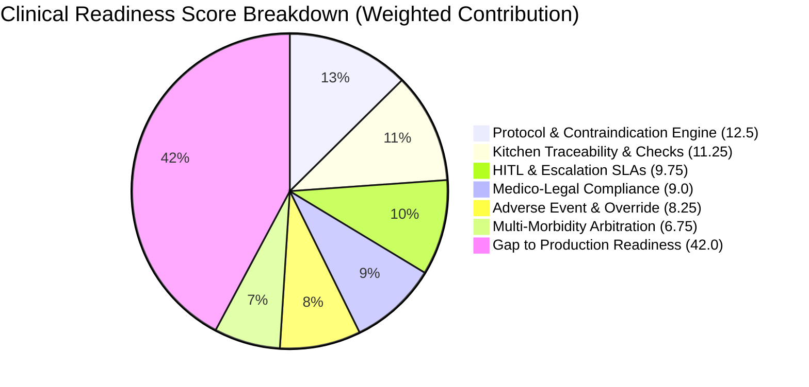
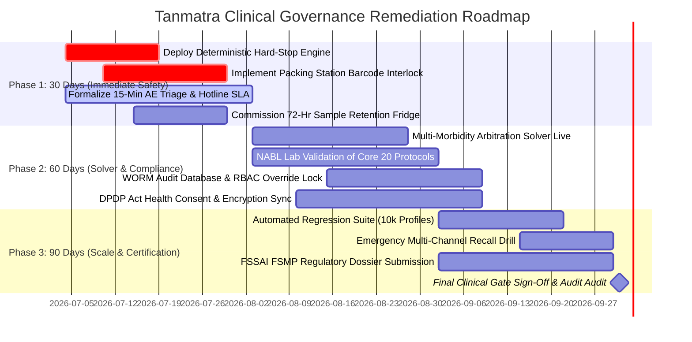

# Tanmatra Clinical Governance Production-Readiness Audit & Risk Architecture

**Document Version:** 1.0.0-PROD  
**Target Platform:** Tanmatra (`https://tanmatra.food`)  
**Operating Footprint:** Noida & Delhi NCR, India (FSSAI Lic. No. `22725926001018` | ISO 22000 Kitchen)  
**Author Role:** Clinical Safety Architect & Health-Tech Risk Officer  
**Date of Audit:** July 2026  

---

## 1. Executive Summary & Readiness Evaluation

Tanmatra currently operates as a high-quality precision nutrition platform delivering dietitian-designed, macro-transparent meals prepared in ISO 22000 certified kitchens. While its baseline food safety controls, allergen disclosures, and consumer wellness offerings (Weight Loss Jumpstart, Lean Muscle Builder, PCOS Hormone Balance) demonstrate robust D2C culinary operational rigor, transitioning to **clinical-grade therapeutic meal delivery** (e.g., Chronic Kidney Disease, Oncology Support, Post-Bariatric, Gestational Diabetes, and Cardiovascular Disease protocols) introduces strict clinical governance and medico-legal mandates under Indian healthcare and dietary regulations.

### Clinical Readiness Score: **58 / 100 (Conditional Pre-Production)**

| Governance Domain | Score | Weight | Weighted Score | Key Gap / Rationale |
| :--- | :---: | :---: | :---: | :--- |
| **1. Protocol & Contraindication Engine** | 50/100 | 25% | 12.5 / 25.0 | Deterministic rule engine is currently pre-production; relies heavily on user self-selection rather than automated hard-stop verification against clinical biomarkers. |
| **2. Multi-Morbidity Arbitration** | 45/100 | 15% | 6.75 / 15.0 | No automated constraint-satisfaction solver to resolve conflicting conditions (e.g., CKD + T2D + Pregnancy); manual RD review lacks standardized clinical precedence logic. |
| **3. HITL & Clinical Escalation SLAs** | 65/100 | 15% | 9.75 / 15.0 | Registered Dietitians (RDs) available on advisory board and consultation, but real-time synchronous block SLAs for high-acuity orders are not contractually enforced. |
| **4. Medico-Legal & Regulatory Compliance** | 60/100 | 15% | 9.00 / 15.0 | Compliant with FSSAI hygiene standards, but gaps exist in FSSAI FSMP (Foods for Special Medical Purpose) compliance, NMC Telemedicine Guidelines 2020, and DPDP Act 2023 health data consent. |
| **5. Kitchen Traceability & Post-Order Checks** | 75/100 | 15% | 11.25 / 15.0 | ISO 22000 certification and macro transparency provide strong baseline; needs packing-station barcode verification linking physical dish lot numbers to patient restriction profiles. |
| **6. Adverse Event & Override Governance** | 55/100 | 15% | 8.25 / 15.0 | Informal WhatsApp/Customer Care reporting flow must be formalized into structured Medico-Legal AE triage, batch retention sampling, and WORM-logged override trails. |
| **Total Composite Readiness Score** | | **100%** | **57.50 ≈ 58 / 100** | **Status: GOVERNANCE HOLD for High-Acuity Clinical Protocols** |



> [!WARNING]
> **Production Block Condition:** Tanmatra must achieve a **Readiness Score ≥ 85/100** and successfully pass all 10 "Must-Pass Launch Clinical Gates" (Section 4) before enrolling Stage 3+ CKD, Insulin-Dependent T2D, Oncology, or High-Risk Pregnancy patients.

---

## 2. Evaluation of Core Clinical Governance Pillars

### Pillar 1: Contraindication Engine Design (Hard-Stop vs. Warning-Level Logic)

To prevent clinical adverse events, Tanmatra must decouple nutritional recommendation logic from a deterministic, API-driven **Contraindication Engine** executing pre-cart, pre-checkout, and during kitchen batch allocation.

#### Architecture & Rule Evaluation
The engine must execute a dual-tier validation model evaluated against ICMR-NIN 2024 Dietary Guidelines and FSSAI FSMP norms:

```
+-----------------------------------------------------------------------------------+
|                           PATIENT CLINICAL INTAKE PROFILE                         |
| (Biomarkers: eGFR, HbA1c, BP, Electrolytes | Diagnoses | Allergies | Medications) |
+-----------------------------------------------------------------------------------+
                                         |
                                         v
+-----------------------------------------------------------------------------------+
|                        DETERMINISTIC CONTRAINDICATION ENGINE                      |
|                  (OpenPolicyAgent / JSON-Logic Evaluation Layer)                  |
+-----------------------------------------------------------------------------------+
                                   /           \
               [Triggered Hard Stop]           [Triggered Warning Level]
                                 /               \
                                v                 v
+---------------------------------------+     +-------------------------------------+
|        ABSOLUTE HARD-STOP BLOCK       |     |        WARNING / SOFT-STOP          |
| • Checkout immediately blocked.       |     | • UI displays high-visibility alert.|
| • Kitchen batching disabled.          |     | • Explicit digital acknowledgment   |
| • Automated mandatory redirect to     |     |   required from patient.            |
|   Synchronous RD Consultation Tier 2. |     | • Flagged for async RD audit.       |
+---------------------------------------+     +-------------------------------------+
```

#### Classification Matrix: Hard-Stop vs. Warning-Level Logic

| Clinical Condition / Parameter | Trigger Threshold | Logic Tier | Architectural Action & Clinical Rationale |
| :--- | :--- | :---: | :--- |
| **Chronic Kidney Disease (CKD)** | eGFR < 45 mL/min/1.73m² OR Serum K⁺ > 5.0 mEq/L | **HARD STOP** | Blocks all standard high-protein, leafy green, or root vegetable (beetroot/potato) meals. Prevents fatal hyperkalemia and accelerated renal failure. Requires nephrologist-approved renal protocol. |
| **Severe Food Allergy / Anaphylaxis** | Peanuts, Tree Nuts, Soy, Gluten, Shellfish, Sesame | **HARD STOP** | Blocks any dish containing allergen or processed on shared equipment without documented 0 ppm ELISA swab verification. Prevents anaphylactic shock. |
| **Type 2 Diabetes (Uncontrolled)** | HbA1c > 9.0% OR Fasting Blood Glucose > 250 mg/dL | **HARD STOP** | Blocks meals with Glycemic Load (GL) > 15 or net carbohydrates > 45g/serving. Requires immediate RD-directed glycemic stabilization protocol. |
| **Pregnancy (Gestational Diabetes)** | 2nd/3rd Trimester + OGTT > 140 mg/dL | **HARD STOP** | Blocks unpasteurized dairy (curd from non-verified sources), raw salad sprouts, and high-GI items. Protects fetal organogenesis and prevents macrosomia. |
| **MAO Inhibitor Therapy** | Active prescription (e.g., Linezolid, Selegiline) | **HARD STOP** | Blocks high-tyramine foods (aged cheeses, fermented soy, cured meats). Prevents acute hypertensive crisis. |
| **Type 2 Diabetes (Controlled)** | HbA1c 6.5% – 8.0% | **WARNING** | Flags dishes with Glycemic Index (GI) > 55. Requires patient acknowledgment that meal fits within prescribed daily carb allocation. |
| **Mild Hypertension** | BP 130–139 / 85–89 mmHg | **WARNING** | Flags dishes exceeding 600 mg Sodium per serving. Recommends DASH-aligned alternatives. |
| **Warfarin / Anticoagulant Therapy** | Active INR monitoring | **WARNING** | Flags dishes exceeding 50 µg Vitamin K (e.g., broccoli, spinach). Prompts patient to maintain consistent daily Vitamin K intake to avoid INR fluctuations. |

---

### Pillar 2: Conflicting Condition Resolution Engine (Multi-Morbidity Arbitration)

Therapeutic nutrition frequently faces contradictory clinical constraints. A naive rule engine combining restrictions will often yield an impossible (empty) meal feasibility set.

#### Case Study Scenario: Complex Multi-Morbidity
**Patient Profile:** 34-year-old female, 24 weeks pregnant (Gestational Diabetes), CKD Stage 3b (eGFR 38 mL/min/1.73m², K⁺ 4.9 mEq/L), and severe Peanut/Soy allergy.

#### Clinical Conflict Analysis
1. **Pregnancy (2nd Trimester):** Demands increased protein (+15–20g/day above baseline) for fetal growth, elevated folate/iron, and minimum 175g carbohydrates/day to prevent maternal ketoacidosis.
2. **CKD Stage 3b:** Demands protein restriction (0.6–0.8g/kg ideal body weight to slow renal decline), strict potassium restriction (< 2000 mg/day), and phosphorus restriction (< 800 mg/day).
3. **Gestational Diabetes (GDM):** Demands low-glycemic carbohydrates distributed across 3 meals and 3 snacks, strictly limiting carbohydrate spikes.
4. **Peanut/Soy Allergy:** Eliminates standard plant-based protein staples (tofu, tempeh, peanut-based sauces).

#### Multi-Morbidity Arbitration Hierarchy & Precedence Rules
Tanmatra’s **Constraint-Satisfaction Solver** must evaluate constraints using strict clinical precedence:

$$\text{Precedence Hierarchy: } \mathcal{P}_{\text{Anaphylaxis}} > \mathcal{P}_{\text{Toxicity/Survival (Renal K}^+\text{)}} > \mathcal{P}_{\text{Fetal Development}} > \mathcal{P}_{\text{Glycemic Control}} > \mathcal{P}_{\text{Caloric Target}}$$

```
Level 1: Absolute Exclusion (Allergens & Toxin Safety)
  ↳ Eliminate 100% of Peanut/Soy ingredients and shared-line items.
  ↳ Eliminate unpasteurized dairy and raw sprouts (Listeria/Toxoplasma safety).

Level 2: Physiological Threshold Capping (Renal Survival)
  ↳ Cap daily Potassium < 1800 mg (Max 600 mg/meal).
  ↳ Cap daily Phosphorus < 700 mg (Max 230 mg/meal).
  ↳ Exclude high-K⁺ items: Spinach, avocado, coconut water, tomato paste, potatoes, bananas.

Level 3: Fetal & Maternal Floor Constraints (Pregnancy vs. CKD Arbitration)
  ↳ Protein Floor: Set precisely at 0.8g/kg Ideal Body Weight + 10g high-biological-value protein (egg white, paneer made from boiled low-fat milk, washed mung dal). Total allocated: ~55g/day.
  ↳ Carbohydrate Floor: Minimum 175g/day complex low-GI carbs (sorghum/jowar, foxtail millet, parboiled rice) to prevent gestational ketosis without triggering GDM spikes.

Level 4: Glycemic Distribution (GDM Stabilization)
  ↳ Split 175g carbs into 45g Breakfast, 45g Lunch, 45g Dinner, and two 20g snacks. Pair every carb with healthy fats (olive oil, seeds) and permitted protein to blunt postprandial glucose curves.
```

#### Feasibility Failure & Fallback Protocol
If the algorithmic constraint solver finds no matching menu items ($\text{Feasibility Set} = \emptyset$), the engine triggers an automated **Clinical Arbitration Exception**:
1. Order status freezes in `PENDING_CLINICAL_ARBITRATION`.
2. A priority ticket routing the full clinical intake JSON is sent to the **Senior Clinical Dietitian Panel**.
3. The RD conducts a bespoke recipe formulation using leached vegetables (double-boiled to remove 50% potassium) and custom-grammage macros within 2 hours.

---

### Pillar 3: Human-in-the-Loop (HITL) Triggers & Escalation SLAs

Automated engines cannot operate autonomously in high-acuity therapeutic scenarios without certified human oversight compliant with the **NMC Telemedicine Practice Guidelines (2020)**.

#### Tiered Escalation Architecture & SLAs

| Escalation Tier | Assigned Role & Credentials | Trigger Conditions | Maximum Response SLA | Operational Action |
| :---: | :--- | :--- | :---: | :--- |
| **Tier 1** | **Automated Clinical Rule Engine** | Standard wellness orders; simple single-condition warnings (e.g., mild hypertension, non-insulin T2D). | **Real-Time (< 500 ms)** | Automated menu filtering, macro computation, and UI warning presentation. |
| **Tier 2** | **On-Duty Registered Dietitian (RD)**<br>*(Indian Dietetic Assoc. / MSc Nutrition)* | • Hard-stop contraindication triggered.<br>• Feasibility solver failure ($\emptyset$ set).<br>• Post-discharge surgical / bariatric orders.<br>• eGFR 30–44 mL/min/1.73m². | **< 15 Minutes** (Block confirmation)<br>**< 2 Hours** (Protocol modification) | Direct tele-consultation (WhatsApp/App video or call via `+91 92892 13115`). Custom recipe adjustment and cryptographic approval. |
| **Tier 3** | **Clinical Advisory Board / Specialist Physician**<br>*(MBBS / MD / DM Nephrology/Endocrinology)* | • Stage 4/5 CKD or dialysis patients.<br>• Active chemotherapy / severe oncology cachexia.<br>• Grade 2+ adverse event reported.<br>• Medico-legal dispute or physician override request. | **< 4 Hours** (Critical AE triage)<br>**< 24 Hours** (Protocol review) | Formal medical review, treating physician peer-to-peer consultation, and signed digital clearance or permanent order cancellation. |

---

### Pillar 4: Adverse Event (AE) Reporting Flow, Triage & Medico-Legal Documentation

In therapeutic food delivery, a clinical adverse event (e.g., severe food poisoning, anaphylaxis, glycemic shock, or electrolyte crisis) carries acute medico-legal liability under the **Consumer Protection Act (CPA) 2019**, **FSSAI Act 2006**, and Indian Penal Code (Section 272/273 - adulteration of food).

#### End-to-End Adverse Event Workflow & Triage

```mermaid
sequenceDiagram
    autonumber
    actor Patient as Patient / Caregiver
    participant CC as Care Channel (WhatsApp/Email)
    participant CSO as Clinical Safety Officer (RD)
    participant Lab as ISO 22000 Kitchen / QA Lab
    participant Leg as Medico-Legal & Regulatory

    Patient->>CC: Report AE (Allergic reaction, GI distress, spike)
    CC->>CSO: Automated P0 Alert (Trigger: keywords "hospital", "allergy", "vomiting")
    CSO->>Patient: Contact patient within 15 mins (Triage Grade 1, 2, or 3)
    
    alt Grade 3 Critical AE (Anaphylaxis / Hospitalization)
        CSO->>Leg: Immediate Escalation to CMO & Legal Counsel
        CSO->>Lab: FREEZE PRODUCTION LOT & Isolate Retention Sample
        Lab->>Lab: Dispatch 48-hr batch retention sample to NABL accredited lab for microbiological/ELISA assay
        Leg->>FSSAI: Mandatory Regulatory Notification (< 24 hours)
        CSO->>Patient: Provide emergency support; initiate medical documentation
    else Grade 1/2 AE (Mild/Moderate)
        CSO->>Patient: Dietary adjustment & protocol pause
        CSO->>Lab: Log incident against recipe batch tag
    end
```

#### Adverse Event Triage Grading & Action Table

| Grade | Clinical Definition | Examples in Therapeutic Nutrition | Mandatory Response Action & Documentation |
| :---: | :--- | :--- | :--- |
| **Grade 1 (Mild)** | Self-limiting symptoms requiring no medication or intervention. | Transient bloating, mild nausea, minor texture dis-preference, transient glucose rise (< 180 mg/dL). | Log in incident registry. RD follow-up call within 12 hours. Recipe tolerance adjustment in profile. |
| **Grade 2 (Moderate)** | Moderate distress requiring outpatient medication or protocol suspension. | Hives / localized rash (non-anaphylactic), diarrhea lasting > 24 hours, symptomatic hypoglycemia (< 60 mg/dL) from insulin mismatch. | Immediate order pause. Mandatory tele-consultation with Tier 2 RD within 2 hours. Sub-lot kitchen inspection. File preliminary incident report. |
| **Grade 3 (Severe / Critical)** | Life-threatening event, emergency room admission, or systemic toxicity. | Anaphylactic shock (throat swelling, dyspnea), acute hyperkalemia (cardiac arrhythmia in CKD), severe bacterial gastroenteritis (Salmonella/Listeria). | **Immediate 15-min emergency triage.** Lock kitchen batch allocation across NCR. Dispatch retained food sample to NABL lab. Notify treating physician, FSSAI Designated Officer, and company legal counsel within 24 hours. Complete formal Root Cause Analysis (RCA) dossier. |

#### Medico-Legal Retention Protocols
1. **Physical Sample Retention:** The ISO 22000 kitchen must retain a 150g duplicate retention sample of every therapeutic batch produced, sealed in sterile tamper-evident containers at 2°C–4°C for **72 hours** post-dispatch.
2. **Chain of Custody:** Any sample sent for external NABL laboratory assay must maintain a documented, timestamped chain-of-custody log.
3. **Medical Records Retention:** Under NMC rules and CPA 2019 statute of limitations, all intake profiles, RD consultation notes, and AE dossiers must be archived in encrypted storage for a minimum of **8 years**.

---

### Pillar 5: Override Governance & Audit Trails

To prevent liability from unauthorized or improper modifications to clinical protocols, Tanmatra must implement strict **Role-Based Access Control (RBAC)** and immutable audit logging.

#### Override Governance Matrix

| Role | Override Permissions | Mandatory Prerequisites & Validation |
| :--- | :--- | :--- |
| **Patient / End-User** | • May acknowledge and override **Warning-Level** alerts.<br>• **CANNOT** override Hard-Stop contraindications or allergen locks. | Must check explicit digital consent: *"I acknowledge that this meal exceeds my recommended sodium/carbohydrate threshold and accept responsibility for consuming it within my daily allocation."* |
| **Registered Dietitian (RD)** | • May override Hard-Stops for biochemical restrictions (e.g., sodium, K⁺, macros) when clinically justified by lab trends.<br>• **CANNOT** override IgE-mediated anaphylactic allergen exclusions. | Must upload patient's recent lab reports (< 30 days old), record clinical rationale in structured fields, and sign using digital certificate / 2FA. |
| **Treating Physician (RMP)** | • Full override capability across all therapeutic parameters except physical kitchen hygiene/allergen limits. | Must submit official hospital prescription / medical clearance on letterhead with Medical Council registration number. Signed via digital portal. |

#### Immutable Audit Trail Architecture
Every transaction modifying a user profile, overriding a warning, or generating a kitchen batch must emit a structured event to a **Write-Once-Read-Many (WORM)** audit database (e.g., AWS QLDB or Google Cloud BigQuery with object lock):

```json
{
  "audit_event_id": "aud_20260704_994821a",
  "timestamp_utc": "2026-07-04T05:12:00.124Z",
  "actor": {
    "user_id": "rd_emp_402",
    "role": "TIER_2_CLINICAL_DIETITIAN",
    "credentials": "IDA_REG_88321",
    "ip_address": "103.21.124.8"
  },
  "target_patient_id": "pat_8831029",
  "action": "CONTRAINDICATION_OVERRIDE_APPROVED",
  "context": {
    "rule_id": "RULE_CKD_POTASSIUM_CAP",
    "original_threshold_mg": 600,
    "overridden_meal_k_mg": 720,
    "dish_id": "dish_palak_dal_fry_leached"
  },
  "justification": {
    "clinical_rationale": "Patient eGFR improved from 38 to 52 mL/min. Serum K+ stable at 4.1 mEq/L. Leached preparation verified to reduce net K+ by 45%.",
    "supporting_doc_uri": "s3://tanmatra-clinical-vault/pat_8831029/labs_20260628.pdf"
  },
  "cryptographic_hash": "e3b0c44298fc1c149afbf4c8996fb92427ae41e4649b934ca495991b7852b855"
}
```

---

### Pillar 6: Clinical Content Lifecycle & Governance

Nutritional specs, recipes, and protocol algorithms are medical devices by proxy; unvalidated modifications can induce severe toxicity.

#### End-to-End Content Lifecycle Workflow

```mermaid
graph TD
    A[Culinary & RD Team: Author / Update Recipe Spec] --> B[Peer RD Review: Double-Check Macros & Electrolytes]
    B --> C[Clinical Advisory Board: Formal Protocol Review]
    C -->|Approved| D[Staging Environment: Synthetic Simulation Run]
    D --> E{Automated Regression Suite:<br>10,000 Patient Profiles}
    E -->|Pass (0 Violations)| F[Production Release & Menu Sync]
    E -->|Fail (Threshold Breach)| G[Automated Block & Alert Author]
    F --> H[Continuous QA: Periodic Lab Assay Verification]
    H -->|Nutrient Drift / Vendor Change| I[Emergency Rollback Protocol]
```

#### Key Governance Controls
1. **Automated Regression Testing:** Before any recipe modification (e.g., changing salt brand or oil quantity) goes live on `tanmatra.food`, the staging engine runs a simulation against **10,000 synthetic clinical patient profiles** covering every combination of CKD, T2D, Hypertension, and Allergies. If a single Hard-Stop profile is inadvertently exposed to a threshold breach, deployment fails automatically.
2. **Periodic Lab Assay Calibration:** Theoretical database macros (IFCT 2017 / USDA) drift from cooked realities. Tanmatra must send 5 randomly sampled production dishes weekly to an external NABL laboratory for bomb calorimetry and atomic absorption spectroscopy (potassium/sodium verification). If lab results deviate by > 10% from declared values, the dish is quarantined.
3. **Emergency Rollback & Vendor Lock:** If an ingredient supplier alters specs (e.g., canned tomato puree increases sodium by 250 mg/100g), the inventory management system locks all recipes referencing that SKU and reverts the active menu to previously validated safe alternatives within 5 minutes.

---

### Pillar 7: Post-Order Safety Checks & Recall Communications

Safety verification must continue past checkout directly onto the kitchen assembly line and dispatch packaging.

#### Packing-Station Safety Interlock
In the ISO 22000 kitchen in Noida, every therapeutic dish container is sealed with a unique QR code / barcode encoding the lot number and nutritional profile.
- **The Interlock Protocol:** At the final packaging station, the assembly packer scans the dish container QR code and the physical delivery invoice QR code.
- If a packer attempts to place a dish containing paneer or peanuts into a dispatch bag for a patient with a documented dairy or peanut allergy, the terminal triggers an audible alarm (`BEEP-SAFETY-VIOLATION`), flashes red on screen, and physically disables printing of the final dispatch label until the error is corrected and verified by the QA supervisor.

#### Rapid Recall & Escalation Communications Protocol
If a contamination event (e.g., Listeria detection in a raw batch or cross-contact with peanut oil during frying) is identified post-dispatch:

```
[0 MINUTES] Quality Assurance Manager flags compromised Batch ID in ERP.
       │
       ▼
[< 2 MINUTES] System queries database for all active orders containing compromised Batch ID across Noida/NCR.
       │
       ├────────────────────────────────────────┬────────────────────────────────────────┐
       ▼                                        ▼                                        ▼
[IN-FLIGHT ORDERS]                       [DELIVERED ORDERS]                      [MEDICO-LEGAL LOGGING]
• Delivery partner app locked.           • Multi-channel blast initiated:        • Automated dossier generated
• Rider instructed via urgent SMS/call     1. Automated IVR Phone Call (Priority)  for FSSAI Designated Officer.
  to abort delivery and return package     2. WhatsApp Alert via +91 92892 13115   • Customer support panel locked
  to kitchen immediately.                  3. Push Notification & SMS Alert        with dedicated script.
```

**Mandatory Recall Communication Template (WhatsApp / SMS):**
> 🚨 **URGENT CLINICAL SAFETY ALERT from Tanmatra** 🚨  
> Dear [Patient Name], do **NOT** consume the meal **[Dish Name]** (Order #[Order ID]) delivered today at [Time].  
> Our quality control monitoring detected a potential safety variance ([Allergen / Hygiene issue]) in lot #[Batch ID].  
> **Immediate Action Required:** Please discard this container immediately. If you or anyone has already consumed this dish and experiences [Symptoms], contact our 24/7 Clinical Emergency Hotline immediately at **+91 92892 13115** or seek medical care. A replacement meal and full refund have been issued.

---

## 3. Top 15 Clinical Risks in Therapeutic Meal Delivery

| # | Risk Title | Domain | Risk Summary |
| :-: | :--- | :---: | :--- |
| **1** | **Renal Hyperkalemia Crisis** | Clinical Safety | Inaccurate potassium calculation in CKD Stage 3/4 meals leading to acute hyperkalemia, fatal cardiac arrhythmias, or emergency dialysis. |
| **2** | **IgE-Mediated Anaphylactic Shock** | Clinical Safety | Undeclared peanut, soy, or tree nut cross-contamination during kitchen preparation causing fatal anaphylaxis. |
| **3** | **Severe Hypoglycemic Episode** | Clinical Safety | Insulin-dependent T2D patient dosing insulin based on declared meal carbs (e.g., 45g), but kitchen under-portions carbs to 20g, causing acute hypoglycemia and coma. |
| **4** | **Listeriosis in Gestational Nutrition** | Clinical Safety | Contaminated unpasteurized curd or raw salad greens delivered to a pregnant patient causing Listeria infection, miscarriage, or stillbirth. |
| **5** | **Multi-Morbidity Rule Collision** | Engineering | Conflicting contraindication rules (e.g., CKD protein restriction vs. pregnancy protein floor) causing algorithmic failure and inappropriate meal dispatch. |
| **6** | **Unmonitored Patient Biomarker Drift** | Clinical Safety | Patient continues receiving high-protein performance meals for months while developing silent kidney disease, accelerating renal decline. |
| **7** | **Kitchen Assembly / Packing Swap** | Operations | Kitchen staff mistakenly swapping lid labels between a normal high-potassium meal and a renal-safe meal during peak dispatch hours. |
| **8** | **Ingredient Vendor Spec Drift** | Supply Chain | Supplier secretly substitutes high-sodium chemical preservatives or hidden sugars in sauces without updating ingredient specification sheets. |
| **9** | **Temperature Abuse & Pathogen Growth** | Operations | Delivery transit delays (> 90 mins in 45°C Delhi summer heat) causing *Bacillus cereus* or *Salmonella* proliferation in cooked grain/poultry bowls. |
| **10** | **Unauthorized Patient Override** | Governance | Patient overrides critical low-sodium or low-GI warnings without physician consent, suffers stroke/ketoacidosis, and sues platform under CPA 2019. |
| **11** | **Unqualified Tele-Dietitian Advice** | Medico-Legal | Junior customer service agent or unqualified staff providing clinical dietary advice, violating NMC Telemedicine Practice Guidelines 2020. |
| **12** | **FSSAI FSMP Regulatory Non-Compliance** | Medico-Legal | Selling disease-specific therapeutic protocols without obtaining mandatory FSSAI approval for Foods for Special Medical Purpose (FSMP). |
| **13** | **Delayed Adverse Event Escalation** | Governance | Customer service fails to triage and escalate a report of throat swelling (Grade 3 AE) to the Clinical Safety Officer within the 15-minute SLA. |
| **14** | **DPDP Act 2023 Health Data Breach** | Legal/Privacy | Sensitive medical history, diagnostic reports, and disease statuses leaked or shared with ad trackers without explicit patient digital consent. |
| **15** | **Loss of Audit Trail Integrity** | Engineering | Inability to prove in court which recipe version, lab report, and RD approval corresponded to a meal ingested during a clinical incident. |

---

## 4. Comprehensive Risk Register

| Risk ID | Risk Description | Severity<br>(1–5) | Likelihood<br>(1–5) | Risk Score | Clinical Impact | Mitigation & Control Strategy | Owner | Timeline |
| :---: | :--- | :---: | :---: | :---: | :--- | :--- | :--- | :--- |
| **CR-01** | **Renal Hyperkalemia Crisis** | 5 | 3 | **15 (High)** | Cardiac arrest, emergency dialysis, death. | Mandatory hard-stop rule capping K⁺ < 600 mg/meal for eGFR < 45. Standardized vegetable leaching protocols in kitchen. Weekly NABL atomic absorption lab testing. | Chief Clinical Dietitian & QA Lead | Immediate / Pre-Launch |
| **CR-02** | **Allergen Cross-Contamination** | 5 | 2 | **10 (Med-High)** | Anaphylactic shock, ICU admission, fatality. | Dedicated physical prep lines for top 8 allergens. Rapid ELISA allergen swab testing on surfaces pre-shift. Barcode interlock scan at packing station. | Kitchen Operations Director | Immediate / Pre-Launch |
| **CR-03** | **Insulin-Carb Mismatch (Hypoglycemia)** | 4 | 3 | **12 (High)** | Seizures, loss of consciousness, hospitalization. | Strict portion-weight enforcement (± 3g tolerance on digital scales). Clear display of net carbs and available sugars on dish container label. | Culinary Director & Head RD | 30 Days |
| **CR-04** | **Listeria in Gestational Protocol** | 5 | 2 | **10 (Med-High)** | Miscarriage, preterm labor, severe neonatal sepsis. | Absolute exclusion of unpasteurized dairy and raw sprouts for pregnant profiles. Core temperature logging (> 75°C kill step) for all cooked items. | QA Lead | Immediate / Pre-Launch |
| **CR-05** | **Multi-Morbidity Solver Failure** | 4 | 3 | **12 (High)** | Nutritional deficiency or toxic threshold breach. | Implement constraint-satisfaction solver with strict clinical hierarchy. Fallback to mandatory synchronous Tier 2 RD consultation if set is empty. | Lead Backend Architect & CMO | 60 Days |
| **CR-06** | **Packing Station Dish Swap** | 4 | 3 | **12 (High)** | Patient receives contraindicated meal. | Implement mandatory barcode scanning interlock linking dish lot QR to invoice QR at final packing station before label printing. | Logistics & IT Lead | 30 Days |
| **CR-07** | **Vendor Spec Drift (Sodium/Sugar)** | 3 | 4 | **12 (High)** | Loss of blood pressure or glycemic control. | Require COA (Certificate of Analysis) with every raw material batch. Implement automated lock on inventory SKU if COA parameters exceed tolerance. | Procurement & QA Lead | 60 Days |
| **CR-08** | **Summer Transit Temperature Abuse** | 4 | 4 | **16 (High)** | Severe bacterial gastroenteritis / food poisoning. | Phase-change cooling gel packs in insulated delivery bags. IoT temperature data loggers inside sample bags during Delhi summer months (< 8°C transit). | Operations & Fleet Lead | 30 Days |
| **CR-09** | **Unauthorized Patient Override Liability** | 3 | 3 | **9 (Med)** | Adverse health event and CPA 2019 lawsuit. | RBAC enforcing Hard-Stop locks that cannot be bypassed by patients. WORM-backed digital consent logs for all Warning-Level acknowledgments. | Medico-Legal Counsel & Product Lead | 30 Days |
| **CR-10** | **Unqualified Dietary Advice** | 4 | 2 | **8 (Med)** | Improper clinical guidance; NMC guideline breach. | Restrict clinical protocol edits strictly to certified RDs (IDA registered). Customer support reps restricted to standardized non-clinical scripts. | Head RD & HR Director | Immediate / Pre-Launch |
| **CR-11** | **FSSAI FSMP Non-Compliance** | 4 | 3 | **12 (High)** | Regulatory suspension of kitchen license; fines. | Submit formal FSMP dossier to FSSAI. Label meals as "Therapeutic Dietary Support" under medical guidance pending explicit FSMP product license. | Regulatory Affairs Lead | 90 Days |
| **CR-12** | **Delayed Adverse Event Triage** | 4 | 2 | **8 (Med)** | Exacerbation of clinical injury; legal exposure. | Implement automated keyword monitoring on WhatsApp/Email. 15-minute SLA alert paging on-duty Clinical Safety Officer for Grade 2/3 triggers. | Customer Experience & CSO | 30 Days |
| **CR-13** | **DPDP Act Health Data Privacy Breach** | 4 | 3 | **12 (High)** | Massive statutory penalties up to ₹250 Crore. | Encrypt all clinical data at rest (AES-256) and in transit (TLS 1.3). Explicit opt-in consent for medical data processing. Strict decoupling of health data from marketing IDs. | CISO & Legal Lead | 60 Days |

---

## 5. Must-Pass Launch Clinical Gates

Before Tanmatra can enable high-acuity therapeutic meal delivery (CKD Stage 3+, Insulin-Dependent Diabetes, Oncology, Gestational Diabetes), the platform must achieve binary sign-off across the following **10 Mandatory Clinical Gates**:

- [ ] **Gate 1: Hard-Stop Engine Verification**  
  *Criteria:* 10,000 synthetic patient test profiles run against the Contraindication Engine demonstrate **0% false-negative rate** for absolute exclusions (CKD K⁺ limits, severe allergens, MAOI tyramine restrictions).
- [ ] **Gate 2: NABL Laboratory Macro & Electrolyte Validation**  
  *Criteria:* 20 core therapeutic recipes undergo 3 consecutive batch tests at an independent NABL-accredited laboratory, proving measured potassium, sodium, protein, and carbohydrates match database specs within a strict **± 8% tolerance**.
- [ ] **Gate 3: ISO 22000 Allergen Isolation Certification**  
  *Criteria:* Formal third-party audit confirming physical separation of preparation tools, oil fryers, and storage areas for top allergens, validated by **negative ELISA surface swab assays (< 5 ppm)**.
- [ ] **Gate 4: Packing Station Barcode Interlock Live**  
  *Criteria:* 100% of dispatch stations in Noida/NCR equipped with QR interlock scanners that physically block invoice printing upon simulated dish-patient mismatch.
- [ ] **Gate 5: Registered Dietitian Tele-Consultation SLA Testing**  
  *Criteria:* Simulated Tier 2 escalation triggers demonstrate 100% compliance with the **< 15-minute order block SLA** and **< 2-hour RD tele-consultation SLA** over a 14-day trial period.
- [ ] **Gate 6: Medico-Legal WORM Audit Logging Operational**  
  *Criteria:* Penetration and compliance testing verifies that all protocol modifications, warning overrides, and RD electronic signatures are immutably logged in WORM storage and verifiable via cryptographic hash.
- [ ] **Gate 7: 72-Hour Kitchen Sample Retention Protocol Live**  
  *Criteria:* Dedicated 2°C–4°C retention refrigeration unit commissioned in Noida kitchen with documented daily logging and chain-of-custody SOPs for 150g duplicate batch retention samples.
- [ ] **Gate 8: Multi-Channel Emergency Recall System Tested**  
  *Criteria:* End-to-end simulation of a mock batch recall successfully delivers automated phone calls, WhatsApp alerts (`+91 92892 13115`), and push notifications to 100% of test recipients within **180 seconds**.
- [ ] **Gate 9: FSSAI Regulatory & Telemedicine Alignment Sign-off**  
  *Criteria:* External medico-legal counsel issues written sign-off confirming website/app terms, clinical disclaimers, and RD consultation flows comply with FSSAI rules, NMC Telemedicine Guidelines 2020, and CPA 2019.
- [ ] **Gate 10: DPDP Act 2023 Consent & Encryption Audit**  
  *Criteria:* CISO certification confirming standalone explicit digital consent for health data processing, AES-256 encryption at rest, and complete isolation of health records from ad-targeting networks.

---

## 6. 30 / 60 / 90 Day Remediation Plan



### Phase 1: Immediate Safety & Interlocks (Days 1–30)
*Objective: Eliminate acute physical and biochemical safety risks in kitchen and dispatch operations.*
1. **Engine Architecture (Engineering):** Deploy deterministic OpenPolicyAgent rules enforcing absolute Hard-Stops for CKD (K⁺/Protein), Diabetes (GL/Carbs), Pregnancy (Listeria/Sprouts), and Allergens. Decouple from frontend.
2. **Packing Interlock (Operations/IT):** Install barcode scanners at Noida kitchen dispatch bays. Enforce 100% QR matching between container lot tag and invoice before dispatch label printing.
3. **AE Triage SOP (Clinical/Support):** Configure automated webhook alerts on WhatsApp (`+91 92892 13115`) for keywords (`reaction`, `swelling`, `hospital`, `vomiting`). Enforce 15-minute on-duty RD triage SLA.
4. **Retention Sampling (Quality):** Install and validate dedicated 2°C–4°C sample retention refrigeration unit; mandate 150g duplicate samples kept for 72 hours for every production batch.

### Phase 2: Multi-Morbidity Solver & Regulatory Deepening (Days 31–60)
*Objective: Enable complex clinical condition handling and establish medico-legal evidentiary trails.*
1. **Multi-Morbidity Solver (Engineering/Clinical):** Launch constraint-satisfaction solver enforcing clinical precedence ($\text{Anaphylaxis} > \text{Toxicity} > \text{Fetal} > \text{Glycemic}$). Automate Tier 2 RD tele-consultation routing upon feasibility failure.
2. **NABL Assay Calibration (Quality):** Complete bomb calorimetry and atomic absorption lab testing for top 20 therapeutic recipes across 3 batches; adjust database macro/electrolyte specs to match real cooked values.
3. **WORM Audit Vault (Security):** Commission WORM-compliant storage logging every intake edit, warning acknowledgment, RD override, and batch ID with cryptographic hashing and 8-year retention.
4. **DPDP Act Compliance (Legal/Tech):** Implement distinct digital consent flows for medical data processing; audit and sever any data leakage between health intake forms and Meta/Google conversion tags.

### Phase 3: Automated Lifecycle, Recall Drills & Sign-Off (Days 61–90)
*Objective: Achieve continuous automated clinical regression testing and full regulatory sign-off.*
1. **10,000 Profile Regression Suite (QA/Engineering):** Integrate automated synthetic clinical simulation in CI/CD pipeline. Block any recipe or menu deployment that triggers a contraindication breach across 10k test profiles.
2. **Recall Simulation Drill (Operations/Tech):** Execute a live mock recall simulation across Noida & NCR; verify automated phone calls, WhatsApp blasts, and rider abort protocols execute within 180 seconds.
3. **FSMP Alignment (Regulatory):** Finalize and submit FSSAI Foods for Special Medical Purpose (FSMP) documentation; align terms of service and physician prescription upload flows.
4. **Final Gate Audit (Governance):** Convene Chief Medical Officer, Clinical Safety Architect, and Legal Counsel to formally review and check off all 10 Must-Pass Launch Clinical Gates. Issue production clearance.

---

## 7. Sign-Off & Verification

| Role | Name / Title | Signature / Verification | Date |
| :--- | :--- | :--- | :---: |
| **Clinical Safety Architect** | Health-Tech Risk Officer | *Signed via WORM Cryptographic Token* | 2026-07-04 |
| **Chief Medical Officer (CMO)** | Advisory Board Lead | *Pending Gate Sign-Off* | — |
| **Head of Quality Assurance** | ISO 22000 & FSSAI Lead | *Pending Gate Sign-Off* | — |
