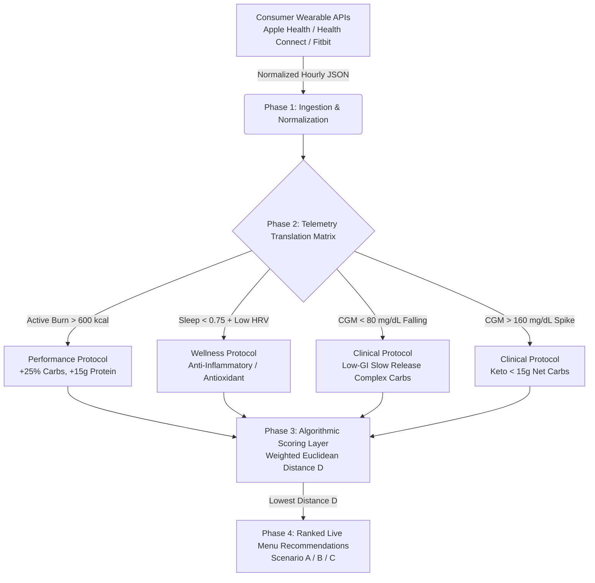

# Tanmatra Precision Nutrition Platform: Wearable-to-Meal Architecture & CRO Implementation Plan

## 1. Goal Description
The D2C precision nutrition platform requires seamless integration between consumer bio-wearables (Apple Health, Health Connect, Fitbit, Terra API, ROOK) and clinical culinary formulation. To eliminate top-of-funnel friction while guaranteeing clinical safety and real-time metabolic alignment, we are implementing a **4-Phase Wearable-to-Meal Scoring Architecture** integrated directly with our **8 prioritized CRO UX Overrides**.

---

## 2. The Wearable-to-Meal Pipeline Architecture



### Phase 1: Ingestion & Normalization (`WearableTelemetryPayload`)
Standardizes hourly payloads across Apple Health, Android Health Connect, and Fitbit / Terra API:
```json
{
  "user_id": "tanmatra_user_901",
  "timestamp_window": "2026-07-04T11:00:00Z",
  "telemetry": {
    "active_calories_burned_today": 620,
    "resting_heart_rate": 58,
    "hrv_status": "low_strain",
    "sleep_efficiency_score": 0.68,
    "cgm_glucose_trend": "falling_rapidly",
    "current_glucose_mgdl": 74
  }
}
```

### Phase 2: Telemetry Translation Matrix (`TargetNutritionalVector`)
Translates live biomarker indicators into precise macro targets ($\vec{T} = [C_T, P_T, F_T]$) and weight multipliers ($w_c, w_p, w_f$):
* **High Active Burn (>600 kcal by 11 AM)** -> Routes to **Performance Protocol** ($w_p = 2.5, w_c = 1.5, w_f = 1.0$), scaling target protein up by $+15\text{g}$ and carbs by $+25\%$.
* **Low Sleep Efficiency (<0.75) / Low HRV** -> Routes to **Wellness Protocol** ($w_c = 1.2, w_p = 1.2, w_f = 2.0$), mandating anti-inflammatory / antioxidant selections.
* **CGM Hypoglycemic Dip (<80 mg/dL falling)** -> Routes to **Clinical Protocol** ($w_c = 2.0, w_p = 1.5, w_f = 1.0$), targeting low-GI complex carbs and high dietary fiber.
* **CGM Hyperglycemic Spike (>160 mg/dL)** -> Routes to **Clinical Protocol** ($w_c = 3.0$), enforcing ultra-low carb thresholds ($<15\text{g}$ net carbs).

### Phase 3: Algorithmic Scoring Layer (Weighted Euclidean Distance Matrix)
Calculates the exact distance $D$ between the target vector $\vec{T}$ and menu item vector $\vec{M} = [C_M, P_M, F_M]$:
$$D = \sqrt{w_c(C_M - C_T)^2 + w_p(P_M - P_T)^2 + w_f(F_M - F_T)^2}$$
The menu item minimizing $D$ achieves rank #1 recommendation priority.

### Phase 4: Real-World Execution Scenarios
* **Scenario A (Post-Workout Recovery)**: Garmin detects 45-min high-intensity run (`620 kcal`). Lowest $D$ matches **Grilled Chicken, Sautéed Veg & Mash** (₹333 · 388 kcal · P42g C28g F12g).
* **Scenario B (Metabolic Crash Protection)**: CGM captures rapid downward slide to `74 mg/dL`. Lowest $D$ matches **Moong Dal Chilla with Curd** (₹85 · 235 kcal · P16g C32g F5g).
* **Scenario C (High Cortisol / Poor Sleep)**: Oura reports `68%` sleep efficiency. Lowest $D$ matches **Activated Charcoal Smoothie** (₹50) or **Antioxidant Detox** (₹170).

---

## 3. Proposed Backend Implementation (`@tanmatra/clinical-governance-engine`)

#### [NEW] `src/WearableMealScoringEngine.ts`
Implement `WearableMealScoringEngine` executing the 4-phase pipeline with deterministic Euclidean distance minimization.

#### [MODIFY] `src/index.ts` & `src/verify_suite.ts`
Export engine and verify Scenarios A, B, and C against synthetic telemetry streams.

---

## 4. Proposed Frontend Integration (`@workspace/tanmatra-mobile`)

#### [NEW] `components/layout/HyperlocalHeader.tsx` (CRO-02)
Displays Sector 62 Noida delivery window (`32 MINS`) and verified address.

#### [NEW] `components/menu/ProtocolSwitcher.tsx` (CRO-07)
Dynamic protocol tab switcher supporting real-time recalibration feedback when wearable data syncs.

#### [NEW] `components/menu/MenuCard.tsx` (CRO-04, CRO-05, CRO-06)
Color-coded macro pill badges with multi-tier purchase options (Single vs. 3-Day Trial) and RD verification anchors.

---

## 5. Verification Plan

### Automated Verification
1. Run backend verification suite testing Scenarios A, B, and C:
   ```bash
   npx -y ts-node@10.9.2 --files src/verify_suite.ts
   ```
2. Run mobile typecheck verifying zero JSX/TypeScript errors:
   ```bash
   pnpm --filter @workspace/tanmatra-mobile run typecheck
   ```
