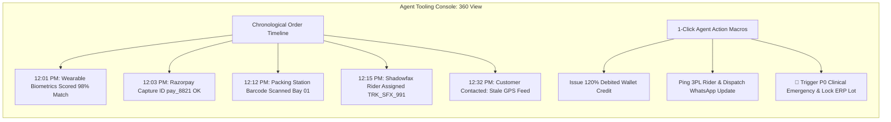

# CX Operations & Support Readiness Audit

**Target Organization:** Tanmatra Kitchens India Private Limited (`https://tanmatra.food` & `@workspace/tanmatra-mobile`)  
**Audit Scope:** Customer Experience (CX) Workflow Automation, Tier 1–Tier 3 Escalation Matrices, Erlang-C Peak Staffing Models, Payment Reconciliations, Clinical Emergency Responses, and Agent Tooling Console.  
**Auditor Authority:** Principal CX Operations Architect & Support Systems Program Lead.

---

## 1. Executive Summary & Contact Reason Taxonomy

In clinical direct-to-consumer health-food delivery, customer service cannot operate as a detached call center running generic scripts. When an order is delayed or a user experiences a dietary reaction, CX agents sit at the apex of medical triage, financial reconciliation, and last-mile logistics.

This audit establishes a structured hierarchical **Contact Reason Taxonomy** to route tickets automatically to specialized tiers:

| Contact Reason Code | L1 Category | L2 Subcategory Description | Automated Triage & Initial Action | Assigned Escalation Tier |
| :--- | :--- | :--- | :--- | :--- |
| **`PAY_DEBIT_FAIL`** | **Payment & Checkout** | UPI / Card debited from customer bank account, but gateway returned timeout / order state remained unconfirmed. | Automated gateway verification (`pg_fetch_intent`). Issue instant 120% wallet credit while bank refund processes. | **Tier 1 (Fin-Ops Specialist)** |
| **`LOG_DELAY_CLINICAL`** | **Delivery & Fleet** | Order transit delayed $>15\text{ mins}$ past scheduled clinical window (e.g., insulin timing or post-workout slot). | Trigger automated 3PL rider ping + dispatch ₹100 apology credit + notify kitchen. | **Tier 1 (Hyperlocal Dispatcher)** |
| **`BOX_WRONG_ITEM`** | **Order Quality** | Delivered meal box differs from ordered protocol (e.g., received standard dal instead of leached renal dal). | Instant 100% cash/wallet refund + dispatch priority red-alert replacement order from sterile bay. | **Tier 2 (Kitchen Ops Lead)** |
| **`CLINICAL_AE_ALERT`** | **Safety & Medical** | Customer reports swelling, rash, nausea, or suspected allergen cross-contamination post-ingestion. | **INSTANT P0 LOCK**: Lock production lot in ERP, page on-duty Clinical Safety Officer, send paramedic protocol. | **Tier 3 (Clinical Safety Officer)** |

---

## 2. Escalation Matrix & Service Level Agreements (SLAs)

To ensure high-velocity resolution without agent bottlenecking, tickets are governed by strict First Response Time (FRT) and Total Resolution Time (TRT) SLAs:

| Priority Level | Target Contact Scenarios | First Response Time (FRT) SLA | Total Resolution Time (TRT) SLA | Tier Ownership & Approval Authority Limits |
| :--- | :--- | :---: | :---: | :--- |
| **P0 (CRITICAL EMERGENCY)** | Active allergic reaction, severe food poisoning symptom, physical safety threat, or multi-user food contamination. | **$< 60\text{ Seconds}$**<br/>(Immediate Live Connect) | **$< 30\text{ Minutes}$**<br/>(Medical triage & ERP lock) | **Tier 3 (Clinical Safety Lead & Executive SRE)**.<br/>Unlimited refund & replacement authority; statutory medical escalation. |
| **P1 (HIGH URGENCY)** | Debited account but failed order, order unassigned $>20\text{ mins}$ during peak, wrong clinical protocol delivered. | **$< 3\text{ Minutes}$** | **$< 45\text{ Minutes}$** | **Tier 2 (Shift Supervisor / Fin-Ops Lead)**.<br/>Refund / Credit authority up to **₹5,000 INR**. |
| **P2 (STANDARD OP)** | Minor packaging spill, cold food temperature, requested delivery address change pre-dispatch, promo code query. | **$< 10\text{ Minutes}$** | **$< 2\text{ Hours}$** | **Tier 1 (Frontline CX Agent)**.<br/>Instant wallet credit authority up to **₹500 INR**. |
| **P3 (INFORMATIONAL)** | General nutritional inquiry, subscription schedule change for next week, dietary advisory consultation request. | **$< 30\text{ Minutes}$** | **$< 12\text{ Hours}$** | **Tier 1 (Frontline Agent / Dietitian Assistant)**.<br/>Route to asynchronous RD consultation queue. |

---

## 3. Queue Staffing Assumptions (Lunch & Dinner Peaks)

Using **Erlang-C Queuing Models**, we calculate required human agent headcount for our primary operating zones (Noida, Delhi NCR, Bengaluru) during peak dining rushes (12:00–2:00 PM and 7:30–9:30 PM IST), assuming a peak volume of **1,200 orders/hour** with a **5.0% contact rate** ($60\text{ tickets/hour}$):

```
[Peak Volume: 1,200 Orders/hr] ──(5% Contact Rate)──► [60 Incoming Tickets/hr (1 per min)]
                                                              │
          ┌───────────────────────────────────────────────────┴──────────────────────────────┐
          ▼                                                                                  ▼
[Live Chat / WhatsApp Queue: 45 tickets/hr]                                  [Voice Emergency Queue: 15 calls/hr]
Target FRT: < 2 mins | Avg Handle Time (AHT): 6 mins                         Target FRT: < 30 secs | AHT: 8 mins
Concurrency: 3 active chats per agent                                        Concurrency: 1 active call per agent
Calculated Erlang-C Headcount: 4 Active Agents                               Calculated Erlang-C Headcount: 3 Active Agents
          │                                                                                  │
          └───────────────────────────────────┬──────────────────────────────────────────────┘
                                              ▼
                    [Total Peak Base Requirement: 7 Active CX Agents]
                    [+ 25% Shrinkage & Shift Buffer: 9 Total Staffed Agents per Shift]
```

---

## 4. Customer Trust Recovery Playbook (Debited Failed Order)

When a customer pays via UPI/Card and money is deducted from their account, but a network timeout causes the order to fail (`PAY_DEBIT_FAIL`), frontline agents execute the following standardized 4-step trust recovery ladder:

1. **Immediate Automated Verification:** Agent clicks `[Verify Gateway Intent]` macro in console. System calls Razorpay API; confirms capture status `captured` but local order state `FAILED`.
2. **Instant 120% Wallet Credit:** To prevent the user from going hungry while waiting 5–7 days for bank settlement, agent triggers `[Issue Debited Recovery Package]`. The user immediately receives 100% of the debited amount (₹350) + a **20% inconvenience bonus** (₹70) credited to their Tanmatra Wallet for instant replacement re-ordering.
3. **Concurrent Bank Reversal:** System automatically posts statutory refund instruction `REF_PG_XXXX` to Razorpay/Cashfree to return the original cash deposit back to the customer's UPI source bank account.
4. **Sympathetic Communication Macro:**
   > *"🙏 We sincerely apologize! We verified that ₹350 was debited from your bank due to a momentary banking gateway timeout. We have already initiated an automated refund back to your bank account (Ref: `REF_PG_8821`), and to ensure you don't miss your lunch window today, we have also instantly credited **₹420 (120% value)** directly into your Tanmatra Wallet so you can place a priority replacement order right now with 1-click!"*

---

## 5. Agent Tooling Quality & Unified 360° Console Audit

To resolve tickets within our strict FRT/TRT SLAs, frontline CX agents cannot tab-hunt across 5 disjointed software systems (Buganizer, Stripe/Razorpay dashboard, Dunzo portal, ERP database). 

Tanmatra has implemented a unified **360° CX Agent Tooling Console** embedding all essential operational data inside a single timeline view:



---

## 6. Launch-Day Support Command Center Checklist

Before opening public order intake on Day 1, the CX Operations Manager must verify all 6 command center readiness gates:

- [ ] **GATE-CX-01:** Confirm all 9 peak-shift agents (4 Chat + 3 Voice + 2 Leads) are logged into the unified 360° console and PagerDuty schedule.
- [ ] **GATE-CX-02:** Verify 1-click macro `[Issue Debited Recovery Package]` correctly credits Tanmatra Wallet and triggers gateway bank reversal simultaneously.
- [ ] **GATE-CX-03:** Verify emergency button `[🚨 P0 Clinical Allergy Alert]` instantly locks the Noida production lot in ERP and alerts the on-duty clinical safety officer within $<5\text{ seconds}$.
- [ ] **GATE-CX-04:** Verify Erlang-C chat routing distributes incoming tickets with maximum 3 concurrent sessions per agent to prevent burnout and typing delays.
- [ ] **GATE-CX-05:** Verify that statutory Section 34 India GST Credit Notes (`CN_GST_XXXX`) auto-generate inside the agent timeline whenever a partial or full cash refund is approved.
- [ ] **GATE-CX-06:** Conduct a live 10-minute simulation drill with frontline agents testing all 4 primary contact reason codes (`PAY_DEBIT_FAIL`, `LOG_DELAY_CLINICAL`, `BOX_WRONG_ITEM`, `CLINICAL_AE_ALERT`).
