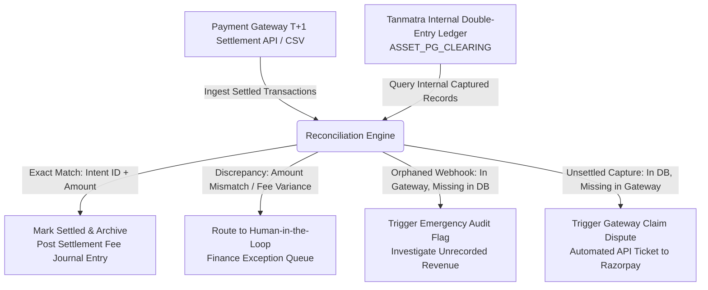

# Payments Reliability & Financial Control Audit (India GST Context)

**Target Organization:** Tanmatra Kitchens India Private Limited (`https://tanmatra.food`)  
**Audit Scope:** Idempotency Architecture, UPI / Payment Gateway Integration (Razorpay / Cashfree), Exactly-Once Kitchen Ticketing, Double-Entry Financial Ledger, India GST Compliance (CGST/SGST/IGST Act Section 34), and T+1 End-of-Day Reconciliation.  
**Auditor Authority:** Lead Payments Reliability Architect & Chartered Financial Systems Control Auditor.

---

## 1. Executive Summary & Test Scenarios

In high-frequency on-demand food delivery across Noida, Delhi NCR, and Bengaluru, financial reconciliation failures directly threaten unit economics and invite severe regulatory penalties under the Indian Goods and Services Tax (GST) framework. This audit evaluates Tanmatra's checkout and ledger architecture against 6 adversarial failure modes:

1. **Scenario 1 (Double-Tap Pay on Unstable Network):** User taps "Pay ₹333" on an unstable 4G/5G connection. The request times out on the client, prompting the user to double-tap while the initial packet is still in flight or queuing at the gateway API.
2. **Scenario 2 (UPI Switch & Abandonment):** User selects UPI (PhonePe / GPay / Paytm), is redirected via intent URL scheme (`upi://pay?...`), completes or abandons authorization in the UPI app, but kills or fails to redirect back to the Tanmatra mobile browser/app.
3. **Scenario 3 (Delayed / Replayed Success Webhooks):** Razorpay / Cashfree webhook callback arrives 45 minutes late due to NPCI / banking aggregator lag, OR an adversary re-plays a captured `payment.captured` webhook payload 5 times.
4. **Scenario 4 (Post-Payment Partial Substitution):** User paid ₹230 (*Beetroot Curd* ₹145 + *Moong Dal Chilla* ₹85 + 5% GST). Noida kitchen runs out of Beetroot Curd mid-prep and substitutes *Antioxidant Detox* (₹170) or issues a ₹145 partial refund while adjusting taxable output liability.
5. **Scenario 5 (Cancellation Before vs. After Kitchen Accept):** User cancels order 15 seconds post-payment (before KDS ticket printed) versus 12 minutes post-payment (after kitchen accept and ingredients prepped).
6. **Scenario 6 (Promo + Wallet + Refund + GST Edge Combinations):** User applies 25% promo code + ₹100 Tanmatra Cash wallet credits across a mixed cart of 5% GST food items and 18% GST delivery fees, followed by a 50% partial refund.

---

## 2. Idempotency Key & Exactly-Once Ticketing Architecture

To guarantee that a transaction is charged and ticketed **exactly once**, Tanmatra enforces a 3-layer deterministic idempotency barrier:

```mermaid
sequenceDiagram
    participant C as Mobile App Client
    participant API as Tanmatra Payment API
    participant L as Double-Entry Ledger / Redis Lock
    participant PG as Payment Gateway (Razorpay/Cashfree)
    participant KDS as Noida Kitchen Display System

    C->>API: POST /checkout/intent (Header: Idempotency-Key: UUID-v4)
    API->>L: SETNX lock:intent:UUID-v4 (TTL 300s)
    alt Lock Acquired (First Attempt)
        API->>PG: Create Order Intent (amount, order_id)
        PG-->>API: pg_order_id_101
        API->>L: Store Intent State (PENDING, pg_order_id_101)
        API-->>C: Return Checkout Session URL / Intent
    else Lock Failed / Duplicate Attempt (Double-Tap)
        L-->>API: Return Cached Intent State (pg_order_id_101)
        API-->>C: Return Existing Cached Session (Zero Duplicate Charge)
    end

    Note over PG,API: Async Webhook Callback (Scenario 3 / Replay Protection)
    PG->>API: POST /webhooks/payment (signature, pg_order_id_101, status: CAPTURED)
    API->>API: Verify HMAC-SHA256 Signature
    API->>L: UPDATE Order State WHERE id=ORD_101 AND status='PENDING' -> 'PAID'
    alt Rows Updated = 1 (Exactly-Once State Transition)
        API->>L: Record Double-Entry Ledger Debit/Credit
        API->>KDS: Dispatch Kitchen Prep Ticket (Print Barcode)
    else Rows Updated = 0 (Replayed Webhook / Already Processed)
        API-->>PG: 200 OK (Idempotent No-Op; Zero Duplicate Kitchen Ticket)
    end
```

### Key Architectural Controls:
* **Client-Side UUID Generation:** Every checkout session generates a client-scoped `Idempotency-Key` (UUIDv4) persisted in local storage until order confirmation or expiry. Double-tapping re-sends the same header.
* **Optimistic Database Locking (`WHERE status = 'PENDING'`):** Webhook handlers execute atomic compare-and-swap SQL updates. If a delayed or replayed webhook attempts to transition an order that is already `PAID`, `CANCELLED`, or `REFUNDED`, 0 rows are updated, and kitchen ticketing is aborted.

---

## 3. Double-Entry Financial Ledger Model & India GST Compliance

Tanmatra maintains an immutable, double-entry financial ledger (`DoubleEntryLedgerRecord`). Every financial event must balance ($\sum \text{Debits} = \sum \text{Credits}$).

### A. India GST Statutory Rules (Cloud Kitchen & Delivery)
1. **Food Services (Cloud Kitchen / Restaurant):** Taxed at **5% GST** (2.5% CGST + 2.5% SGST for intrastate Delhi NCR / Karnataka orders) **without Input Tax Credit (ITC)** under Notification No. 11/2017-Central Tax (Rate).
2. **Delivery & Convenience Fees:** Taxed separately at **18% GST** (9% CGST + 9% SGST).
3. **Promotions & Wallet Application:** Discounts are applied pro-rata to taxable base values *before* calculating GST output liability.
4. **Post-Payment Refunds / Substitutions (Section 34 CGST Act):** When an item is refunded or substituted downward post-sale, Tanmatra must issue a statutory **GST Credit Note** referencing the original tax invoice number, reversing exact CGST and SGST output liabilities to reconcile monthly GSTR-1 and GSTR-3B filings.

### B. Double-Entry Ledger Journal Entries (Scenario 6 & 4)

#### 1. Initial Order Confirmation (Gross ₹400 Food + ₹50 Delivery - ₹100 Promo - ₹50 Wallet)
* Taxable Food Base: ₹250 $\rightarrow$ CGST (2.5%): ₹6.25 | SGST (2.5%): ₹6.25
* Taxable Delivery Base: ₹50 $\rightarrow$ CGST (9%): ₹4.50 | SGST (9%): ₹4.50
* Net Payable via Gateway: ₹221.50 | Wallet Debited: ₹50.00

| Account Code | Account Name | Debit (INR ₹) | Credit (INR ₹) |
| :--- | :--- | :---: | :---: |
| `ASSET_PG_CLEARING` | Razorpay / Cashfree Clearing Account | 221.50 | |
| `LIABILITY_USER_WALLET` | Tanmatra Consumer Wallet Balance | 50.00 | |
| `REVENUE_FOOD_SALES` | Food Sales Revenue (Net of Promo) | | 250.00 |
| `REVENUE_DELIVERY_FEES` | Delivery & Logistics Revenue | | 50.00 |
| `LIABILITY_GST_CGST_OUTPUT` | CGST Output Liability Account | | 10.75 |
| `LIABILITY_GST_SGST_OUTPUT` | SGST Output Liability Account | | 10.75 |
| **TOTAL** | | **271.50** | **271.50** |

#### 2. Post-Payment Partial Refund (Scenario 4: Refund ₹100 Food Base due to Stockout)
* Statutory Action: Issue GST Credit Note `CN_GST_2026_0891`.
* Pro-rata GST Reversal: CGST (2.5%): ₹2.50 | SGST (2.5%): ₹2.50. Total Refund to Gateway: ₹105.00.

| Account Code | Account Name | Debit (INR ₹) | Credit (INR ₹) |
| :--- | :--- | :---: | :---: |
| `REVENUE_FOOD_SALES` | Food Sales Revenue (Contra-Revenue) | 100.00 | |
| `LIABILITY_GST_CGST_OUTPUT` | CGST Output Liability Account (Reversal) | 2.50 | |
| `LIABILITY_GST_SGST_OUTPUT` | SGST Output Liability Account (Reversal) | 2.50 | |
| `ASSET_PG_CLEARING` | Razorpay / Cashfree Clearing Account (Refund Out) | | 105.00 |
| **TOTAL** | | **105.00** | **105.00** |

---

## 4. Financial Control Matrix (Preventive / Detective / Corrective)

| Control ID | Control Class | Risk / Failure Mode | Technical Enforcement Mechanism | Verification Audit Frequency |
| :--- | :--- | :--- | :--- | :--- |
| **CTRL-FIN-01** | **Preventive** | Double-Charge / Network Replay | Client-generated `Idempotency-Key` UUID enforced via Redis `SETNX` lock and DB unique index on `intent_id`. | Continuous automated integration testing on every PR. |
| **CTRL-FIN-02** | **Preventive** | Webhook Forgery & Replay | HMAC-SHA256 webhook signature validation against gateway secret + atomic SQL state transition (`status='PENDING'`). | Real-time signature check on 100% of inbound payloads. |
| **CTRL-FIN-03** | **Preventive** | Split-Brain Kitchen Ticketing | KDS ticket dispatch is coupled to the atomic database commit transitioning order state to `PAID`. Zero async race conditions. | 100% transactional coupling. |
| **CTRL-FIN-04** | **Detective** | Unbalanced Journal Entry | Ledger insertion middleware validates $\sum \text{Debits} == \sum \text{Credits}$ to 2 decimal places before committing transaction. | 100% of financial ledger writes. |
| **CTRL-FIN-05** | **Detective** | UPI Drop-off / Abandoned Intent | Cron sweeper job executes every 5 mins, querying gateway API for `PENDING` intents $>15\text{ mins}$ old, updating ledger to `EXPIRED`. | Automated cron every 5 minutes. |
| **CTRL-FIN-06** | **Corrective** | GST Liability Mismatch / Overpayment | Automated Section 34 GST Credit Note generator triggers on any downward price adjustment or refund, posting tax reversals. | Automated on refund; audited monthly before GSTR-3B filing. |
| **CTRL-FIN-07** | **Corrective** | Gateway Settlement Discrepancy | End-of-day T+1 reconciliation engine matches gateway settlement CSV/API reports against internal `ASSET_PG_CLEARING` ledger entries. | Daily at 04:00 AM IST. |

---

## 5. T+1 End-of-Day Reconciliation & Exception Queue Blueprint

Every morning at 04:00 AM IST, the reconciliation engine ingests the T+1 settlement batch from Razorpay/Cashfree and matches it against Tanmatra's internal ledger:



### Human-in-the-Loop Exception Queue Rules:
* Variances $< \text{₹2.00}$ (rounding differences) are auto-posted to `EXPENSE_ROUNDING_VARIANCE`.
* Variances $\ge \text{₹2.00}$ or orphaned records freeze automated payout release and alert the Finance Systems Controller via PagerDuty / Buganizer.

---

## 6. Go-Live Payment Gates & Rollback Plan

Before switching live payment gateway keys in production, the release must pass 4 critical gates:

- [ ] **GATE-PAY-01:** 100% test pass rate across synthetic double-tap network replay, delayed webhooks, and Section 34 GST Credit Note generation.
- [ ] **GATE-PAY-02:** Live penny-drop testing (₹1.00 transaction + ₹1.00 refund) verified on both Razorpay and Cashfree production MID terminals.
- [ ] **GATE-PAY-03:** Automated circuit breaker configured: if payment gateway webhook latency exceeds $>5000\text{ ms}$ or failure rate exceeds $>5\%$ over 3 minutes, automatically switch primary payment routing from Razorpay to Cashfree.
- [ ] **GATE-PAY-04 (Rollback Kill Switch):** If both payment gateways experience regional NPCI outages, toggle `ENABLE_WHATSAPP_O2O_PAYMENT_FALLBACK=1` to convert all checkout flows into direct WhatsApp UPI payment link requests managed by cloud kitchen triage leads.
