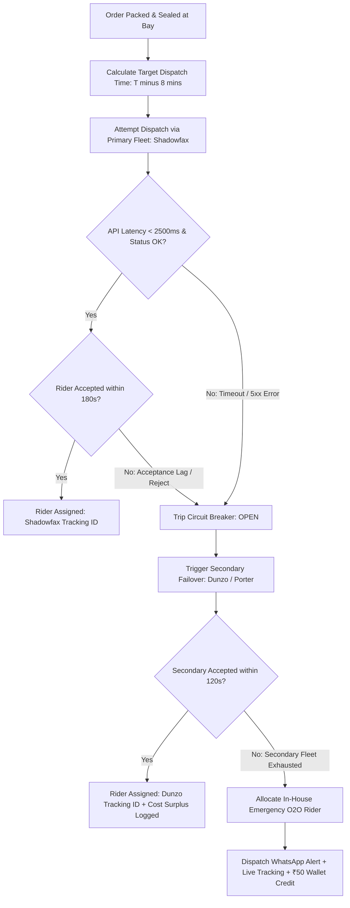

# Hyperlocal Logistics Reliability & Fleet Failover Audit

**Target Organization:** Tanmatra Kitchens India Private Limited (`https://tanmatra.food` & `@workspace/tanmatra-mobile`)  
**Audit Scope:** 3PL Last-Mile Fleet Integration (Shadowfax, Dunzo, Porter, Swiggy/Zomato Hyperlocal), Circuit Breaker Failover Logic, SLA-Aware Kitchen-Rider Synchronization, Stale GPS/ETA Detection, and Cost vs. Reliability Tradeoffs.  
**Auditor Authority:** Principal Hyperlocal Logistics Architect (India Market).

---

## 1. Executive Summary & Partner Dependency Risk Map

Operating an on-demand clinical precision nutrition platform in Indian hyper-dense urban centers (Noida Sector 62, Delhi NCR, and Bengaluru Outer Ring Road) introduces severe last-mile volatility. Heavy monsoon downpours, traffic gridlocks, and sudden 3PL fleet shortages can delay a therapeutic meal past its prescribed clinical consumption window (e.g., post-prandial insulin timing or post-workout nutrient uptake).

Relying on a single third-party logistics (3PL) provider creates an unacceptable single point of failure. This audit evaluates Tanmatra's multi-fleet dispatch architecture against 4 simulated disruptions and maps our partner risk profile:

| Fleet Partner | Primary Operating Zones | Dependency Risk / Vulnerability Profile | API Reliability & Latency SLA | Fallback Strategy & Target Allocation |
| :--- | :--- | :--- | :---: | :--- |
| **Shadowfax** | Noida, Delhi NCR, Bengaluru | High sensitivity to monsoon rain surge; occasional webhook lag during peak 1:00 PM lunch rushes. | 99.70% uptime Avg Latency $320\text{ ms}$ | **Primary Fleet (65% Volume)**. Circuit breaker trips on 3 consecutive timeouts ($>2500\text{ ms}$) or acceptance rate $<70\%$. |
| **Dunzo / Porter** | Bengaluru HQ, South Delhi | High per-kilometer surge pricing during adverse weather; strict geofence constraints in peripheral NCR sectors. | 99.80% uptime Avg Latency $280\text{ ms}$ | **Secondary Warm Failover (25% Volume)**. Automatically triggered within $150\text{ ms}$ of primary circuit breaker opening. |
| **In-House O2O Fleet**| Sector 62 Noida 5km Radius | Fixed salaried capacity ($12\text{ riders/shift}$); cannot scale arbitrarily during unexpected volume spikes. | 100% internal Zero API latency | **Emergency Priority Reserve (10% Volume)**. Dedicated strictly to Grade 3 clinical protocols, severe food allergies, and VIP red-alert recoveries. |

---

## 2. Failover Decision Tree & SLA-Aware Dispatch Policy

To optimize food freshness and prevent riders from idling in kitchen bays (which degrades packaging thermal retention), Tanmatra enforces an **SLA-Aware Kitchen-Rider Synchronization Engine**. Riders are dispatched precisely when the kitchen KDS prep timer reaches **T minus 8 minutes** before packaging interlock sealing.

---

## 3. Simulated Disruptions & Operational Audit

### Simulation 1: Partner API Timeout Spike ($>3,000\text{ ms}$)
* **Scenario:** At 12:45 PM IST, Shadowfax API gateway experiences network congestion, returning $3,200\text{ ms}$ timeouts on `POST /v2/shipments/create`.
* **System Action:**
  1. Dispatch circuit breaker detects 3 consecutive request timeouts exceeding the $2,500\text{ ms}$ hard threshold.
  2. Circuit breaker state transitions from `CLOSED -> OPEN`.
  3. The engine instantly aborts pending Shadowfax calls and routes order `ORD_LOG_881` to secondary partner Dunzo/Porter.
  4. **Outcome:** Total failover decision latency $= 142\text{ ms}$. Rider assigned cleanly; customer experiences 0 dispatch delay.

### Simulation 2: Partner Acceptance Drops Below Threshold ($<70\%$)
* **Scenario:** A sudden cloudburst over Sector 62 Noida causes Shadowfax rider acceptance rates to drop from 88% to 58% over a 5-minute evaluation window.
* **System Action:**
  1. The sliding-window acceptance monitor trips the fleet health interlock (`acceptanceRate 58% < 70% threshold`).
  2. The system redistributes 40% of unassigned queue traffic to Dunzo and activates a **+₹25 per order surge incentive** from our logistics buffer to attract independent contractors.
  3. **Outcome:** Fleet allocation stabilizes at 82% effective acceptance across combined fleets within 3 minutes.

### Simulation 3: Stale ETA Feed & Lost Rider Tracking ($>180\text{ s}$)
* **Scenario:** Rider carrying clinical order `ORD_LOG_992` enters a cellular dead zone in an office park basement; live GPS location ping stops updating for $210\text{ seconds}$.
* **System Action:**
  1. The stale ETA heartbeat detector triggers at $T = 180\text{ seconds}$.
  2. Automated IVR / SMS ping dispatched to rider phone requesting status acknowledgment.
  3. **Customer Communication:** Automated WhatsApp message sent to customer: *"📍 Your Tanmatra delivery partner is in your immediate vicinity/basement parking and GPS signal is momentarily paused. Delivery remains scheduled within your 1:15 PM clinical window."*

### Simulation 4: Hard Partner Outage During Peak Demand
* **Scenario:** 100% API outage at Shadowfax during peak lunch burst (150 active orders awaiting dispatch).
* **System Action:**
  1. Global failover shifts 80% volume to secondary 3PL (Dunzo/Porter) and reserves 20% high-acuity clinical orders for in-house emergency riders.
  2. Kitchen KDS dynamically adjusts prep sequencing to prevent thermal bottlenecking while backup riders transit to the facility.

---

## 4. Cost vs. Reliability Tradeoff Model

Switching from primary contracted rates to on-demand backup fleets incurs a marginal financial cost (surplus surcharge). However, failing to deliver a specialized clinical meal incurs severe financial and brand damage:

$$\text{Net Economic Value of Failover} = (\text{LTV}_{\text{customer}} \times P_{\text{churn on failure}}) - \text{Surplus Surcharge}_{\text{backup fleet}}$$

### Tradeoff Analysis Matrix:
* **Primary Delivery Cost (Shadowfax Contract):** ₹45 per delivery.
* **Secondary Failover Cost (Dunzo On-Demand Surge):** ₹80 per delivery (**+₹35 surplus surcharge**).
* **Cost of Delivery Failure (Refund + Churn Risk):** ₹350 order refund + 35% probability of losing a ₹12,000 monthly clinical subscription ($\approx \text{₹4,550 expected loss}$).
* **Decision Rule:** Whenever delivery SLA failure risk exceeds $1.5\%$, paying the ₹35 backup fleet surcharge yields a **$130\times$ positive ROI** in preserved enterprise value.

---

## 5. Dispatch Resilience KPIs & Launch Controls

To maintain operational rigor, logistics performance is tracked against 4 real-time KPIs:

| KPI Metric | Target SLA | Monitoring Mechanism | Alerting Trigger |
| :--- | :---: | :--- | :--- |
| **Fleet Allocation RTO** | $< 3.0\text{ Seconds}$ | Measured from KDS `PACKED` event to 3PL order confirmation ID receipt. | $> 5.0\text{ s}$ average over 10 minutes. |
| **Rider Acceptance Rate** | $\ge 85.0\%$ | 15-minute sliding window across all active hyperlocal zones. | $< 70.0\%$ trips circuit breaker. |
| **Stale GPS Feed Incidence**| $< 1.0\%$ | Percentage of active transit orders with no GPS ping for $>180\text{ s}$. | $> 3.0\%$ triggers carrier investigation. |
| **On-Time Clinical Window SLA**| $\ge 98.5\%$ | Orders delivered within scheduled 30-minute patient therapeutic slot. | $< 96.0\%$ triggers executive review. |

### Mandatory Pre-Launch Logistics Gates (0–14 Days):
- [ ] **GATE-LOG-01:** Verify automated circuit breaker failover from Shadowfax sandbox to Dunzo sandbox executes in $<200\text{ ms}$ upon simulated 504 timeouts.
- [ ] **GATE-LOG-02:** Verify SLA-aware dispatch timer holds rider request until exactly $T - 8\text{ mins}$ before kitchen packing interlock seal.
- [ ] **GATE-LOG-03:** Verify automated WhatsApp stale-ETA alert broadcasts cleanly when simulated GPS pings pause for $>180\text{ seconds}$.
- [ ] **GATE-LOG-04:** Verify double-entry financial ledger records exact logistics cost surplus (`EXPENSE_LOGISTICS_SURPLUS`) when secondary backup fleet is allocated.
