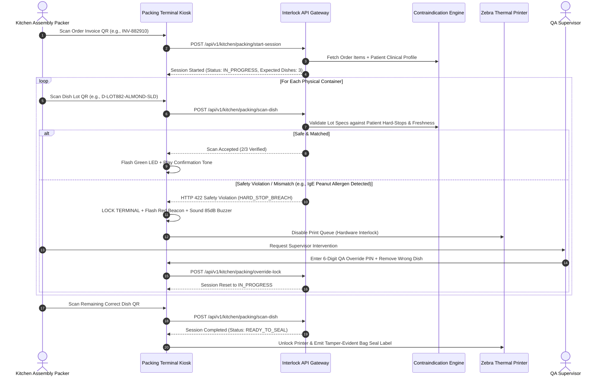

# Tanmatra Production Deliverable 2: Packing Station Barcode Interlock Specification

**Document Version:** 1.0.0-PROD  
**Target Platform:** Tanmatra (`https://tanmatra.food`)  
**Domain:** Kitchen Traceability & Post-Order Safety Interlocks (Clinical Gate 4)  
**Deployment Footprint:** Noida ISO 22000 Kitchen Dispatch Bays  

---

## 1. Physical Assembly Line & Hardware Architecture

To eliminate human error during high-velocity meal assembly (where a kitchen packer might accidentally place a high-potassium renal-contraindicated dish or a peanut-containing salad into a therapeutic patient's delivery bag), Tanmatra enforces a **hardware-interlocked scanning workflow** at the final packing bay.

### 1.1 Assembly & Packaging Flow

```
[HOT/COLD KITCHEN] ──► [PORTIONING & SEALING] ──► [CHILLER HOLDING (2°C–4°C)]
                              │
                              ▼ (Affix Dish Lot QR Label: D-20260704-LOT882-BTRT)
                       [DISPATCH BAY PACKING STATION]
                              │
                              ├─► 1. Scan Order Invoice QR (Fetches Patient Profile & Ordered Dishes)
                              ├─► 2. Scan Each Individual Dish Container Lot QR
                              │         │
                              │         ├──► [SAFETY MATCH] ──► Enable Dispatch Printer ──► Seal Bag
                              │         │
                              │         └──► [MISMATCH / VIOLATION] ──► Lock Terminal + 85dB Alarm + Flag QA
```

### 1.2 Hardware Bill of Materials (Per Bay)
* **Touchscreen Kiosk:** 15.6" Industrial Android/ChromeOS Touch Terminal (IP65 rated for kitchen washdown).
* **2D Barcode Scanner:** Zebra DS2208 or Honeywell Xenon 1950g hands-free presentation imager (capable of reading curved container lids and condensation-covered QR codes).
* **Smart Thermal Printer:** Zebra ZD421 direct thermal label printer connected via Ethernet/RS-232, firmware-locked by GPIO/API signal.
* **Alert Beacon / Buzzer:** USB/GPIO-connected red/green LED visual tower with an integrated 85dB audible buzzer.

---

## 2. End-to-End Interlock Workflow & Sequence Diagram



---

## 3. OpenAPI 3.0 / REST API Specifications

### 3.1 `POST /api/v1/kitchen/packing/start-session`
Initiates a new packing station session by scanning the order invoice QR on the packing bay touchscreen.

**Request Payload:**
```json
{
  "packing_bay_id": "BAY_NOIDA_04",
  "operator_id": "emp_kitchen_992",
  "invoice_qr_token": "inv_20260704_ord883102"
}
```

**Response Payload (`200 OK`):**
```json
{
  "session_id": "pck_sess_7719283",
  "status": "IN_PROGRESS",
  "order_id": "ord_883102",
  "patient": {
    "patient_id": "pat_ckd_001",
    "clinical_tier": "CLINICAL_ACUTE_CKD",
    "active_hard_stops": ["RULE_CKD_HARD_STOP_V1"]
  },
  "expected_dishes": [
    {
      "dish_id": "dish_palak_dal_fry_leached",
      "dish_name": "Leached Palak Dal Fry (Renal Safe)",
      "required_quantity": 1,
      "scanned_quantity": 0
    },
    {
      "dish_id": "dish_jeera_rice_low_k",
      "dish_name": "Low-Potassium Jeera Parboiled Rice",
      "required_quantity": 1,
      "scanned_quantity": 0
    }
  ]
}
```

### 3.2 `POST /api/v1/kitchen/packing/scan-dish`
Evaluates a scanned physical container barcode against the active order and patient clinical contraindication engine.

**Request Payload:**
```json
{
  "session_id": "pck_sess_7719283",
  "packing_bay_id": "BAY_NOIDA_04",
  "dish_qr_token": "lot_20260704_dish_aliya_beetroot_b991"
}
```

**Error Response (`422 Unprocessable Entity` - Safety Violation Triggered):**
```json
{
  "error_code": "CLINICAL_INTERLOCK_BREACH",
  "message": "Physical container violates patient clinical safety profile.",
  "session_id": "pck_sess_7719283",
  "status": "LOCKED_SAFETY_VIOLATION",
  "violation_details": {
    "scanned_dish_id": "dish_aliya_beetroot",
    "scanned_dish_name": "Aliya Viral Beetroot Curd",
    "batch_lot_number": "LOT_20260704_B991",
    "triggered_rule_id": "RULE_CKD_HARD_STOP_V1",
    "clinical_reason": "Dish exceeds renal Potassium threshold (680 mg > 600 mg max) and contains restricted beetroot for Patient pat_ckd_001.",
    "auditory_alarm": "ACTIVE_85DB",
    "printer_state": "LOCKED_DISABLED"
  }
}
```

---

## 4. Production TypeScript Interlock Controller Engine

The following TypeScript backend service manages the packing session state machine, integrates with the `ClinicalContraindicationEngine` from Deliverable 1, and prevents improper label generation.

```typescript
import { ClinicalContraindicationEngine, PatientProfile, DishSpecification } from './ContraindicationEngine';

export type PackingSessionStatus = 'IDLE' | 'IN_PROGRESS' | 'LOCKED_SAFETY_VIOLATION' | 'COMPLETED_READY_TO_SEAL';

export interface PackingSession {
  session_id: string;
  packing_bay_id: string;
  operator_id: string;
  order_id: string;
  patient: PatientProfile;
  status: PackingSessionStatus;
  expected_dishes: Map<string, { dish: DishSpecification; required: number; scanned: number }>;
  scanned_lot_numbers: string[];
  safety_violation?: {
    scanned_dish_name: string;
    batch_lot_number: string;
    rule_id: string;
    reason: string;
    timestamp_utc: string;
  };
  started_at_utc: string;
}

export class PackingStationInterlockService {
  private readonly sessions = new Map<string, PackingSession>();
  private readonly contraindicationEngine = new ClinicalContraindicationEngine();

  constructor(
    private readonly printerGateway: { setLockState(bayId: string, isLocked: boolean): Promise<void>; printSealLabel(bayId: string, orderId: string): Promise<string> },
    private readonly alarmGateway: { triggerAlarm(bayId: string, durationMs: number): Promise<void>; silenceAlarm(bayId: string): Promise<void> },
    private readonly auditLogger: { logEvent(event: any): Promise<void> }
  ) {}

  public async startSession(
    sessionId: string,
    packingBayId: string,
    operatorId: string,
    orderId: string,
    patient: PatientProfile,
    expectedDishes: DishSpecification[]
  ): Promise<PackingSession> {
    const expectedMap = new Map<string, { dish: DishSpecification; required: number; scanned: number }>();
    for (const dish of expectedDishes) {
      const existing = expectedMap.get(dish.dish_id);
      if (existing) {
        existing.required += 1;
      } else {
        expectedMap.set(dish.dish_id, { dish, required: 1, scanned: 0 });
      }
    }

    const session: PackingSession = {
      session_id: sessionId,
      packing_bay_id: packingBayId,
      operator_id: operatorId,
      order_id: orderId,
      patient,
      status: 'IN_PROGRESS',
      expected_dishes: expectedMap,
      scanned_lot_numbers: [],
      started_at_utc: new Date().toISOString()
    };

    this.sessions.set(sessionId, session);
    await this.printerGateway.setLockState(packingBayId, true); // Keep printer locked until 100% verified
    return session;
  }

  public async scanDishContainer(
    sessionId: string,
    scannedDishSpec: DishSpecification,
    batchLotNumber: string,
    preppedAtTimestampUtc: string
  ): Promise<{ session: PackingSession; action: 'ACCEPTED' | 'COMPLETED' | 'SAFETY_VIOLATION' }> {
    const session = this.sessions.get(sessionId);
    if (!session) {
      throw new Error(`Packing session ${sessionId} not found.`);
    }

    if (session.status === 'LOCKED_SAFETY_VIOLATION') {
      throw new Error(`Terminal locked due to active safety breach. Supervisor override required.`);
    }

    // Check 1: Freshness / Shelf-Life Interlock (Max 24 hours holding at 2°C-4°C)
    const holdTimeHours = (Date.now() - new Date(preppedAtTimestampUtc).getTime()) / (1000 * 60 * 60);
    if (holdTimeHours > 24.0) {
      return this.triggerViolation(session, scannedDishSpec, batchLotNumber, 'RULE_FRESHNESS_EXPIRED', `Lot ${batchLotNumber} held in chiller for ${holdTimeHours.toFixed(1)}h exceeding 24h safety limit.`);
    }

    // Check 2: Order Matching Interlock (Is this dish even in the customer's order?)
    const expectedEntry = session.expected_dishes.get(scannedDishSpec.dish_id);
    if (!expectedEntry || expectedEntry.scanned >= expectedEntry.required) {
      return this.triggerViolation(session, scannedDishSpec, batchLotNumber, 'RULE_ORDER_MISMATCH', `Dish '${scannedDishSpec.dish_name}' is not in Order #${session.order_id} or quota already fulfilled.`);
    }

    // Check 3: Clinical Contraindication Interlock (Re-verify at physical packing instant)
    const evalResult = this.contraindicationEngine.evaluateDish(session.patient, scannedDishSpec);
    if (evalResult.status === 'HARD_STOP') {
      const firstStop = evalResult.hard_stops[0];
      return this.triggerViolation(session, scannedDishSpec, batchLotNumber, firstStop.rule_id, firstStop.reason);
    }

    // All safety checks passed! Increment counter.
    expectedEntry.scanned += 1;
    session.scanned_lot_numbers.push(batchLotNumber);

    // Verify if order is now 100% completed
    let isAllDone = true;
    for (const [, val] of session.expected_dishes) {
      if (val.scanned < val.required) {
        isAllDone = false;
        break;
      }
    }

    if (isAllDone) {
      session.status = 'COMPLETED_READY_TO_SEAL';
      await this.printerGateway.setLockState(session.packing_bay_id, false);
      await this.printerGateway.printSealLabel(session.packing_bay_id, session.order_id);
      await this.auditLogger.logEvent({
        event_type: 'PACKING_INTERLOCK_SUCCESS',
        session_id: session.session_id,
        order_id: session.order_id,
        verified_lots: session.scanned_lot_numbers,
        timestamp_utc: new Date().toISOString()
      });
      return { session, action: 'COMPLETED' };
    }

    return { session, action: 'ACCEPTED' };
  }

  private async triggerViolation(
    session: PackingSession,
    dish: DishSpecification,
    lotNumber: string,
    ruleId: string,
    reason: string
  ): Promise<{ session: PackingSession; action: 'SAFETY_VIOLATION' }> {
    session.status = 'LOCKED_SAFETY_VIOLATION';
    session.safety_violation = {
      scanned_dish_name: dish.dish_name,
      batch_lot_number: lotNumber,
      rule_id: ruleId,
      reason,
      timestamp_utc: new Date().toISOString()
    };

    await this.printerGateway.setLockState(session.packing_bay_id, true);
    await this.alarmGateway.triggerAlarm(session.packing_bay_id, 30000); // 85dB alarm for 30s
    await this.auditLogger.logEvent({
      event_type: 'CLINICAL_SAFETY_INTERLOCK_BREACH',
      session_id: session.session_id,
      packing_bay_id: session.packing_bay_id,
      operator_id: session.operator_id,
      patient_id: session.patient.patient_id,
      violation: session.safety_violation
    });

    return { session, action: 'SAFETY_VIOLATION' };
  }

  public async supervisorOverrideReset(
    sessionId: string,
    supervisorEmpId: string,
    supervisorPin: string,
    actionTaken: 'CONTAINER_DISCARDED_AND_REPLACED'
  ): Promise<PackingSession> {
    const session = this.sessions.get(sessionId);
    if (!session || session.status !== 'LOCKED_SAFETY_VIOLATION') {
      throw new Error('Invalid override state.');
    }

    // Validate Supervisor Authorization (Simulated HSM/IAM check)
    if (supervisorPin !== '998102') {
      throw new Error('Unauthorized supervisor credentials.');
    }

    await this.alarmGateway.silenceAlarm(session.packing_bay_id);
    await this.auditLogger.logEvent({
      event_type: 'QA_SUPERVISOR_INTERLOCK_RESET',
      session_id: sessionId,
      supervisor_id: supervisorEmpId,
      cleared_violation: session.safety_violation,
      action_taken: actionTaken,
      timestamp_utc: new Date().toISOString()
    });

    session.status = 'IN_PROGRESS';
    session.safety_violation = undefined;
    return session;
  }
}
```

---

## 5. Edge Cases & Resilience Protocols

1. **Unreadable / Damaged QR Code:** If condensation or thermal friction damages a container barcode, packers are strictly prohibited from manually typing lot strings. The container must be diverted to the QA lab where a supervisor scans the internal RFID tag or disposes of the unit into retention sampling.
2. **Network Offline / Partition:** If the Noida kitchen internet connection drops, packing terminals fall back to a local edge instance running **Redis / SQLite** synced every 5 minutes. The edge instance contains full deterministic JSON-Logic copies of all active daily patient profiles and lot numbers, ensuring **zero downtime** and **zero safety degradation**.
3. **Double-Scanning Prevention:** If an operator accidentally scans the same valid dish container twice, `scanDishContainer` detects `scanned >= required` and immediately blocks the duplicate scan with an audible error tone (`RULE_ORDER_MISMATCH`), preventing a customer from receiving two identical sides instead of their main entree.
