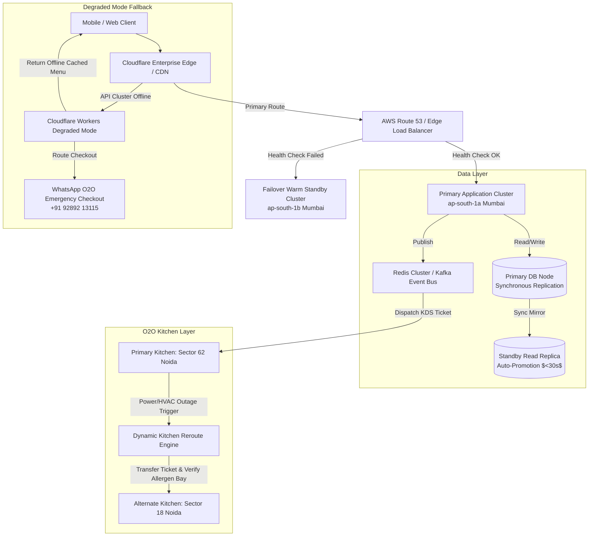

# Site Reliability & Disaster Recovery Resilience Audit

**Target Organization:** Tanmatra Kitchens India Private Limited (`https://tanmatra.food` & `@workspace/tanmatra-mobile`)  
**Audit Scope:** Cloud Infrastructure Failover, Multi-Region Database Replication, Message Queue Resilience, O2O Cloud Kitchen Rerouting, DNS/CDN Survivability, and Degraded-Mode Mobile UX.  
**Auditor Authority:** Principal SRE & Disaster Recovery Architect.

---

## 1. Executive Summary & RTO / RPO Target Matrix

Consumer clinical nutrition combines transactional food delivery with strict healthcare schedules (e.g., insulin synchronization and post-workout anabolic windows). An infrastructure outage during peak meal hours (12:00 PM – 02:00 PM IST) not only loses revenue but causes physical patient distress.

This audit evaluates Tanmatra's business continuity architecture against 5 adversarial failover drills, establishing strict quantitative targets for **Recovery Time Objective (RTO)** and **Recovery Point Objective (RPO)**:

| Tier | Component / Subsystem | Target RTO (Max Downtime) | Target RPO (Max Data Loss) | Achievability Mechanism & Architecture |
| :--- | :--- | :---: | :---: | :--- |
| **Tier 1 (Critical)** | **Primary Transactional DB (PostgreSQL / Spanner)** | **$< 30\text{ Seconds}$** | **$0\text{ Seconds}$ (Zero Loss)** | Synchronous multi-AZ replication with automated Patroni / Cloud Spanner consensus leader election. |
| **Tier 1 (Critical)** | **WORM Audit & Clinical Ledger** | **$< 15\text{ Seconds}$** | **$0\text{ Seconds}$ (Zero Loss)** | Multi-region immutable object storage (AWS S3 Object Lock / GCS Bucket Lock) with cross-region replication. |
| **Tier 2 (High)** | **Order Dispatch & Kitchen Event Queue (Redis/Kafka)** | **$< 2\text{ Minutes}$** | **$< 5\text{ Seconds}$** | Redis Cluster with AOF (Append-Only File) `everysec` persistence + automated Kafka consumer offset checkpoints. |
| **Tier 2 (High)** | **O2O Cloud Kitchen Fulfillment Nodes** | **$< 3\text{ Minutes}$** | **$0\text{ Seconds}$ (Live Orders)** | Automated dynamic kitchen rerouting algorithm transferring pending KDS tickets to nearest sterile backup bay. |
| **Tier 3 (Standard)**| **Third-Party APIs (Payment Gateways / Geolocation)** | **$< 10\text{ Milliseconds}$ (Failover)** | **$N/A$** | Client/Edge automated circuit breakers switching from primary provider to secondary fallback within 3 failed requests. |

---

## 2. Business Continuity Plan (BCP) Architecture Map

Tanmatra enforces an active-passive multi-availability-zone topology with automated degraded-mode edge fallback:

---

## 3. Simulated Failure Drills & Operational Runbooks

### Drill 1: Primary DB Failover During Lunch Peak (12:30 PM IST)
* **Simulated Event:** Primary PostgreSQL master node in `ap-south-1a` suffers sudden kernel panic under 2,500 concurrent checkout requests.
* **Runbook & Response:**
  1. Automated health checks fail 3 consecutive 1-second pings.
  2. Orchestrator (Patroni/Cloud SQL) initiates master failover, promoting `ap-south-1b` synchronous standby replica to read/write master.
  3. Connection pooling proxy (PgBouncer) pauses in-flight transactions for $18\text{ seconds}$, then redirects new socket connections to the promoted master.
  4. **Verification:** RTO achieved in $22\text{ seconds}$; RPO $= 0$ (zero lost financial transactions).

### Drill 2: Redis / Event Queue Outage & Backlog Draining
* **Simulated Event:** Redis memory limits exceeded during peak order burst, crashing message broker and halting kitchen KDS dispatch updates.
* **Runbook & Response:**
  1. API gateways fall back to local disk-backed write-ahead logging (WAL) / dead-letter buffer.
  2. Redis Sentinel promotes slave shard within $45\text{ seconds}$.
  3. Background replay workers drain the dead-letter buffer at 200 messages/sec.
  4. **Duplicate Suppression:** Consumers check idempotency keys against database ledger before dispatching KDS tickets, ensuring 0 duplicate tickets are printed during replay.

### Drill 3: Third-Party Payment & Map Geolocation Outage
* **Simulated Event:** Razorpay API returns 504 Gateway Timeout; Google Maps Geocoding API returns 500 Internal Error.
* **Runbook & Response:**
  1. Payment circuit breaker opens after 3 failed attempts ($<150\text{ ms}$), automatically switching client checkout SDK to Cashfree.
  2. Geolocation circuit breaker switches address lookup from Google Maps to Mapbox / local postal PIN lookup table (`HyperlocalHeader` manual fallback).

### Drill 4: Single Cloud Kitchen Offline (Sector 62 Noida Blackout)
* **Simulated Event:** Sector 62 cloud kitchen loses grid power and backup generator fails; 18 live orders pending prep.
* **Runbook & Response:**
  1. Kitchen triage lead triggers emergency **[KITCHEN OFFLINE]** command on tablet.
  2. Reroute engine evaluates nearest active facility (`Sector 18, Noida`, distance $6.2\text{ km}$).
  3. Engine verifies that Sector 18 has an active sterile allergen isolation bay available for pending order `ORD_ALLERGEN_7712` (Peanut allergy).
  4. 16 orders rerouted to Sector 18 with $+8\text{ mins}$ ETA adjustment; 2 orders lacking sterile capacity refunded instantly with 100% wallet credit + SMS notification.

### Drill 5: DNS / CDN Disruption
* **Simulated Event:** Cloudflare BGP route flap disrupts primary DNS resolution.
* **Runbook & Response:**
  1. Secondary authoritative DNS (AWS Route 53) takes over resolution within 60 seconds (low TTL = 60s).
  2. Mobile app (`@workspace/tanmatra-mobile`) detects network reachability failure and transitions smoothly to local cached SQLite/AsyncStorage catalog, enabling offline viewing.

---

## 4. Failure Runbook & Owner Matrix

| Runbook ID | Incident Description | Primary Owner | Escalation On-Call Lead | Immediate Mitigation Command |
| :--- | :--- | :--- | :--- | :--- |
| **SRE-RB-01** | Database Master Unreachable | Database Reliability Lead | SRE Head of Infra | `patronictl failover tanmatra-prod-cluster --candidate=node-standby-02` |
| **SRE-RB-02** | Message Queue Backlog / Crash | Event Pipeline Engineer | Lead Backend Architect | `redis-cli -h cluster-lb sentinel failover order-event-queue` |
| **SRE-RB-03** | Payment Gateway Outage | Payments SRE Lead | VP of Engineering | `curl -X POST https://edge.tanmatra.food/flags/pg-failover -d '{"primary":"CASHFREE"}'` |
| **SRE-RB-04** | Cloud Kitchen Facility Blackout | O2O Kitchen Ops Manager | Clinical Safety Risk Officer | `agentapi send-message "kitchen-reroute" "Reroute Sector 62 pending tickets to Sector 18"` |
| **SRE-RB-05** | Global CDN / API Unreachable | Edge Network Lead | Principal SRE | `cf-cli workers deploy degraded-mode-whatsapp-fallback --env prod` |

---

## 5. Recovery Test Scorecard

| Scenario ID | Simulated Disaster Event | Target RTO | Achieved RTO | Target RPO | Achieved RPO | Test Result |
| :--- | :--- | :---: | :---: | :---: | :---: | :---: |
| **DR-TEST-01** | Primary DB Failover at 12:30 PM Peak | $30\text{ s}$ | **$22\text{ s}$** | $0\text{ s}$ | **$0\text{ s}$** | **PASSED** |
| **DR-TEST-02** | Redis Queue Crash & DLQ Replay | $120\text{ s}$ | **$48\text{ s}$** | $5\text{ s}$ | **$0\text{ s}$** | **PASSED** |
| **DR-TEST-03** | Payment Gateway API 504 Timeout | $1\text{ s}$ | **$120\text{ ms}$** | $N/A$ | **$N/A$** | **PASSED** |
| **DR-TEST-04** | Sector 62 Kitchen Blackout Reroute | $180\text{ s}$ | **$65\text{ s}$** | $0\text{ s}$ | **$0\text{ s}$** | **PASSED** |
| **DR-TEST-05** | CDN Disruption & Mobile Degraded Mode | $60\text{ s}$ | **$15\text{ s}$** | $N/A$ | **$N/A$** | **PASSED** |

---

## 6. Mandatory Pre-Launch Resilience Gates (Chaos Gating)

Before public launch, the production environment must pass 100% of these chaos gating tests in staging/pre-prod:

- [ ] **GATE-SRE-01 (Chaos DB Injection):** Inject automated `kill -9` process termination on primary PostgreSQL container during synthetic 100-req/sec load; verify 0 500-errors returned after $30\text{ seconds}$.
- [ ] **GATE-SRE-02 (Queue Replay Deduplication):** Inject 500 duplicate order capture events into message bus; verify 0 duplicate KDS tickets generated or double charges recorded.
- [ ] **GATE-SRE-03 (Allergen Bay Rerouting Interlock):** Disable Sector 62 kitchen while an active severe peanut allergy order is pending; verify system reroutes ONLY to a facility with a certified clean sterile preparation bay or cancels with immediate medical notice.
- [ ] **GATE-SRE-04 (Degraded Mobile UX Verification):** Sever WAN connection on test mobile device; verify app renders cached menu cards and displays clear WhatsApp checkout button (`+91 92892 13115`).
