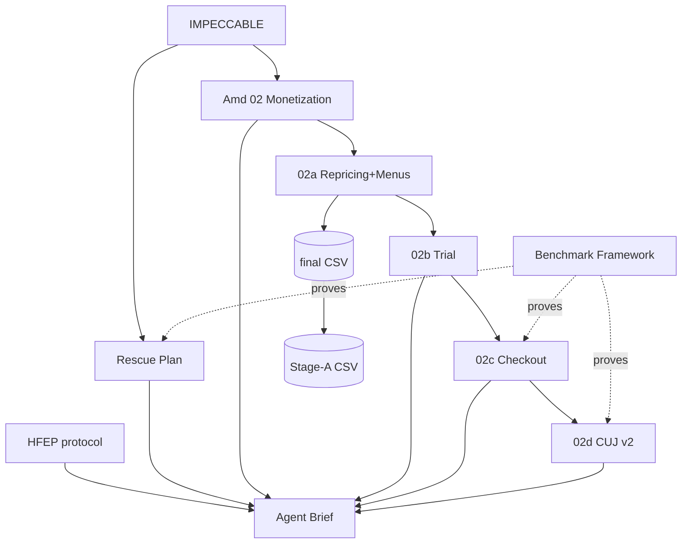

# 00 — TANMATRA MASTER INDEX

**Date:** 2026-07-22 · **Audience:** engineering agents first, humans second · **Suggested repo home:** /docs/spec/ with this file at its root; CSVs alongside.

> Transcribed into the repo from the Google Doc source (`1ZluxxdjZBr6IK0pubvghF0nx8_UCoTv49bW5bI5GPRg`) on 2026-07-22. If this copy and the Doc diverge, the Doc wins until the corpus is fully repo-homed; report the divergence.

**The one rule of this file:** it is a map, never a source. No rule is fully restated here — each is one canonical line plus its authoritative section. If this index ever appears to conflict with a source document, **the source wins** and you report the discrepancy. Editing a rule means editing its source and bumping its version; forking a rule into this index is forbidden.

## 1. Artifact registry

| File | Role | Layer |
|---|---|---|
| IMPECCABLE.md | Binding UI/design-system contract (dark + light, safety, honesty, DoD) | Constitution |
| tanmatra-frontend-rescue-plan.md | Rebuild architecture, Phase 0–4, fix-before-port, anti-rot rules | Architecture |
| tanmatra-benchmark-framework.md | Two-bar model, journeys, measurement protocols, scoreboard | Proof |
| agent-brief-pricing-live.md | Execution law: Session A (old build) + Sessions B (rebuild map), prohibitions | Execution |
| tanmatra-monetization-amendment-02.md | Market foundation, 5 plans, copy system, chips, attach architecture | Commercial |
| tanmatra-repricing-and-menus-02a.md | Pricing architecture, plan menus, data-integrity gates | Commercial |
| tanmatra-trial-plan-02b.md | 3-Day Taste Test: pricing, creditback, eligibility | Commercial |
| tanmatra-plan-config-02e.md | **Collated plan configuration**: all plans + trial as one implementable table (pools, gates, defaults, credit logic) | Commercial |
| tanmatra-checkout-breeze-02c.md | 3-screen checkout, load budgets, certainty devices | Experience |
| tanmatra-ui-construction-02f.md | **Component manifest + screen compositions**: what to build, in what order, mobile rules, photography specs | Experience |
| tanmatra-subscription-cuj-v2-02d.md | Router, defaults doctrine, onboarding beats, funnel events | Experience |
| tanmatra-catalog-repricing.csv | **Authoritative final prices**, 117 SKUs (new_direct_rs, new_aggregator_rs) | Data |
| tanmatra-stageA-prices.csv | **Authoritative Stage-A prices** (stageA_paise) — old build only | Data |
| HFEP SKILL.md (repo) | Agent operating protocol: blast radius, epistemics, git discipline | Meta |

## 2. Dependency graph

Reading of the arrows: 02-series amendments **extend and defer to** IMPECCABLE and the rescue plan's one-pillar scope; the agent brief **operationalizes** all of them; the benchmark **judges** all of them.

## 3. Precedence on conflict

Absolute trumps, in order: **(1)** IMPECCABLE §11 safety-critical UI and §2.6 honest commerce · **(2)** server authority — §10.1 / rescue §3.1 · **(3)** HFEP epistemics (never guess, never invent). Below those, route by question type: *what must the UI do* → IMPECCABLE · *which build/phase/sequence* → agent brief §1 + rescue plan phases · *what to sell and at what price* → 02-series, with the CSVs authoritative on every number · *what counts as done/fast/good* → benchmark framework + IMPECCABLE §17 + per-doc budgets. A later amendment never silently overrides an earlier constitution clause — 02b's no-auto-convert and 02c's no-coupon-field are *applications* of §2.6, which is why they exist.

## 4. The ten invariants (canonical lines; sources are law)

1. **Server computes, client displays** — money, macros, eligibility, quotas. *(IMP §10.1, rescue §3.1)*
2. **Never guess data** — allergens, macros, GI, recipes: contain and escalate, never resolve by assumption. *(Brief A4/A5, HFEP)*
3. **Measure before assert** — every perf/correctness/a11y claim ships with its number. *(Benchmark §0, IMP §3.2/§3.3)*
4. **Fail loud** — typed errors, honest microcopy; silent fallback data is banned. *(Rescue §3.2, IMP §13)*
5. **One decision per screen; evict decisions upstream.** *(02c §2, 02d §3)*
6. **Honest commerce** — no urgency theater, no coupon field, no auto-convert, price shown = price charged. *(IMP §2.6; 02b; 02c)*
7. **Safety is exempt from minimalism** — FSSAI marks and allergen info are untouchable and never gated. *(IMP §11)*
8. **Make failure modes unrepresentable** — framework/CI constraints over discipline: file caps, Next routing, server-rendered grids, Playwright gates. *(Rescue §4/§7)*
9. **Tokens only, both themes, verified contrast** — no raw hexes, no dark-tuned accents on light. *(IMP §3–§3.4, §17.10)*
10. **Old build gets data + safety only; experience ships on the rebuild.** *(Brief §1, 02b §6)*

## 5. Session loading map (context economy — load these, skip the rest)

| Session | Load | Explicitly skip |
|---|---|---|
| **Session A** (old build, this week) | Brief §0–§2 + stageA_paise CSV + rescue §3 + IMP §10/§13 + HFEP | 02b/02c/02d, benchmark, light-theme sections |
| **Phase 1** (skeleton) | Rescue plan + IMPECCABLE full + benchmark §5 | 02-series commercial detail |
| **Phase 2** (money path) | Brief §3 + 02, 02a (+final CSV), 02b, 02c, 02d + IMP full | Session-A material |
| **Phase 3** (polish) | Benchmark full + IMP §14/§15/§17 + 02c §4 / 02d §9 budgets | pricing rationale docs |
| **Benchmark run** | Benchmark framework + latest /benchmarks/runs/*.json | everything else |

## 6. Shared numbers (stop re-deriving; sources in parentheses)

Plans: Desk Fuel **₹199/meal · ₹4,378/mo** · Steady ₹229 · Protein Build ₹249 · GLP-1 **₹5,999 intro / ₹6,999** · Teams ₹189@25+ *(02 §2)*. Attach: RD bump **+₹499/mo** (target ≥10%) · Evening Add **+₹599/week** (≥12%) *(02 §5, 02a §4)*. Trial: **₹399**, full creditback ≤7 days, trial+weekly = ₹1,199 exactly, conv target ≥35% *(02b)*. Pricing: catalog median ₹130 → Stage-A ₹169 (max +49%) → final ₹199; direct ≈ aggregator × 0.78; never cut *(02a §2, CSVs)*. Performance contract: LCP ≤2.0s · CLS ≤0.05 · INP ≤200ms · JS ≤170KB · TTFB target ≤500ms **(measured 2.52s — Phase 0)** *(rescue §5, benchmark §1)*. Journey budgets: reorder ≤3 taps · checkout ≤9 taps/≤4 fields new, 0 fields returning · CUJ 5 decisions, ≤14 taps landing→subscribed *(02c §4, 02d §9)*. Baselines: menu→cart **28.1%** (successor metric plan_view → builder_confirm) · money-path E2E pass **0% → gate 20/20** *(benchmark J3/J4)*. Market: meal-card exemption **₹200/meal** since Apr 2026 *(02 §1)*. Funnel vocabulary: cuj_pin_ok … cuj_week2_retained *(02d §9)*.

## 7. Open blockers — Chandan-owned (agents report against these, never work around them)

1. Kitchen truth on **Ragi Dates Brownie** (veg vs Eggs allergen) — SKU stays contained until answered.
2. **Pluxee/Sodexo merchant onboarding** — start now; gates the ₹199 meal-card story and the payment rail flag.
3. **RD capacity (hours/mo)** + sign-off on Steady GI pool and GLP-1 Companion builds — gates two plan launches and bump inventory.
4. **Recipes for 3 new SKUs** (Sattu Shake, Millet Khichdi Bowl, tofu bowl) — agents never author ingredients.
5. **PSI API key** + one **India-network baseline run** of the old build (before-picture for every phase gate).
6. Non-blocking: ₹499 vs ₹799 bump test decision · light-default confirmation stands as specced (IMP §3.3) unless revisited.

## 8. Change protocol

Docs are versioned in their headers. To change a rule: edit the source section, bump its version/date, update the one-line pointer here if wording drifted, note it in the commit. Two documents stating the same rule in different words is a defect in this system — this index exists so it never has to happen.
